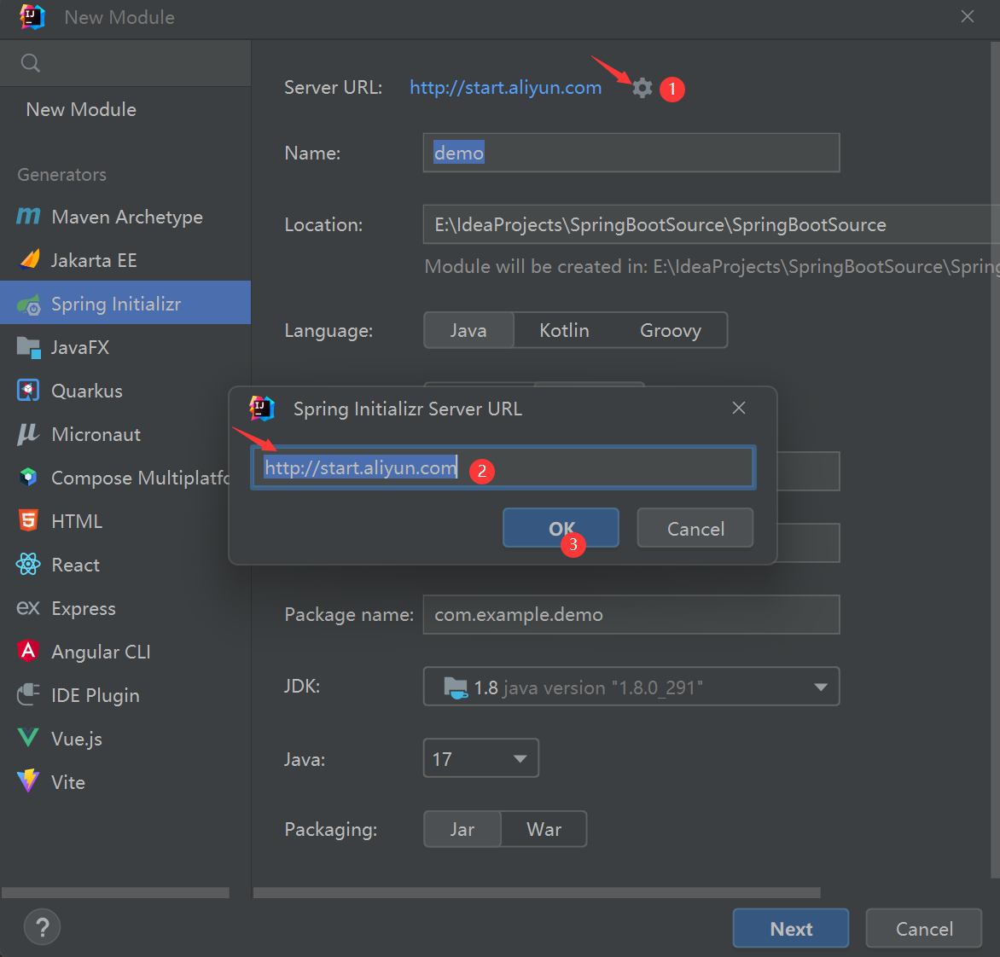
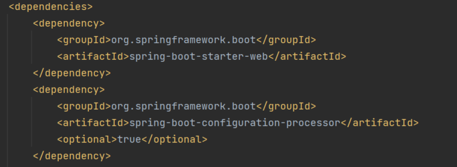
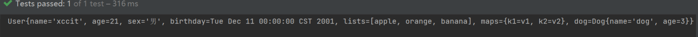
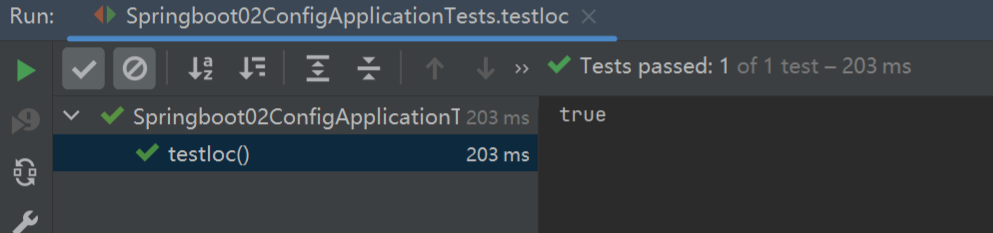

# SpringBoot核心技术

## 简介

> Spring Boot makes it easy to create stand-alone, production-grade Spring based Applications that you can "just run".
>
> We take an opinionated view of the Spring platform and third-party libraries so you can get started with minimum fuss. Most Spring Boot applications need minimal Spring configuration.
>
> If you’re looking for information about a specific version, or instructions about how to upgrade from an earlier release, check out the project release notes section on our wiki.
>
> Spring Boot使您可以轻松地创建独立的、基于生产级Spring的应用程序，您可以“直接运行”这些应用程序。
>
> 我们对Spring平台和第三方库采取了固执己见的观点，这样您就可以在开始时尽量减少麻烦。大多数Spring Boot应用程序需要最少的Spring配置。
>
> 如果您正在查找有关特定版本的信息，或有关如何从早期版本升级的说明，请查看我们wiki上的项目发布说明部分。

## 入门工程

### 环境约束

* JDK1.8+
* Intellij IDEA2019+
* Maven3.x
* SpringBoot2.x.x

### 环境搭建

#### 1.新建SpringBoot(WEB)工程


#### 2.导入依赖

```xml
<!--父工程-->
<parent>
    <groupId>org.springframework.boot</groupId>
    <artifactId>spring-boot-starter-parent</artifactId>
    <version>2.6.3</version>
</parent>
<!--web依赖-->
<dependencies>
    <dependency>
        <groupId>org.springframework.boot</groupId>
        <artifactId>spring-boot-starter-web</artifactId>
    </dependency>
</dependencies>
```

#### 3.编写Controller

```java
@Controller
public class HelloController {

    @ResponseBody
    @RequestMapping("/hello")
    public String hello(String name){
        System.out.println(name);
        return "Hello:"+name;
    }
}
```

> 不使用官方的Spring Initializr新建工程的话,需要自己手写启动类

#### 4.启动类(可选)

```java
/**
 * @SpringBootApplication 用来标识这是一个SpringBoot程序,使用main()作为程序入口
 */
@SpringBootApplication
public class Springboot01HelloApplication {

    public static void main(String[] args) {
        SpringApplication.run(Springboot01HelloApplication.class, args);
    }

}
```

> 启动类与controller,service,mapper等组件的层级关系总是启动类要高一级,在三个组件的上一级目录


#### 5.测试


> 由于SpringBoot工程内置web容器且默认为tomcat,所以启动在8080端口,访问/hello请求,具体查看HelloController.java


## 场景启动器starter

> 为什么SpringBoot不用做任何配置就可以简易开发项目?

### 1.parent依赖

```xml
<parent>
    <groupId>org.springframework.boot</groupId>
    <artifactId>spring-boot-starter-parent</artifactId>
    <version>2.6.3</version>
</parent>
```

> ctrl+鼠标左键,进入此依赖的xml中


> 此依赖还有一层父工程

### 2.dependencies依赖

```xml
<parent>
    <groupId>org.springframework.boot</groupId>
    <artifactId>spring-boot-dependencies</artifactId>
    <version>2.6.3</version>
</parent>
```


> 几乎包含了所有开发中会用到的组件以及中间件等,是真正意义上管理SpringBoot工程的父依赖,在引入此依赖后,确定使用的SpringBoot版本后,在引入其他依赖例如MySQL后,是不需要写版本号的,因为dependcies依赖中已经替我们设置好了版本.

### 3.导入的依赖

```xml
<dependency>
    <groupId>org.springframework.boot</groupId>
    <artifactId>spring-boot-starter-web</artifactId>
</dependency>
```

> web应用场景启动器,帮我们导入了web场景需要的依赖

### 4.总结

> SpringBoot将所有场景抽取出来,制作成一个个starter(启动器),需要时,只需要在项目中引入相关的starter,版本由SpringBoot控制


## 自动配置

### 1.启动类

> 使用@SpringBootApplication标注SpringBoot应用的启动类

```java
@Target({ElementType.TYPE})
@Retention(RetentionPolicy.RUNTIME)
@Documented
@Inherited
@SpringBootConfiguration
@EnableAutoConfiguration
@ComponentScan(
    excludeFilters = {@Filter(
    type = FilterType.CUSTOM,
    classes = {TypeExcludeFilter.class}
), @Filter(
    type = FilterType.CUSTOM,
    classes = {AutoConfigurationExcludeFilter.class}
)}
)
public @interface SpringBootApplication {...}
```

#### 1.1 @SpringBootConfiguration

SpringBoot配置,标注在某个类上,表示是一个SpringBoot的配置类

```java
@Target({ElementType.TYPE})
@Retention(RetentionPolicy.RUNTIME)
@Documented
@Configuration
@Indexed
public @interface SpringBootConfiguration {...}
```

@Configuration:标注在类上表示此类是一个Spring配置类,使用配置类代替传统的配置文件,配置类也是容器中的一个组件

#### 1.2 @EnableAutoConfiguration

开启自动配置,以前需要手动配置的东西交由SpringBoot自动配置

```java
@Target({ElementType.TYPE})
@Retention(RetentionPolicy.RUNTIME)
@Documented
@Inherited
@AutoConfigurationPackage
@Import({AutoConfigurationImportSelector.class})
public @interface EnableAutoConfiguration {...}
```

@AutoConfigurationPackage:自动配置包,**<u>将主配置类(@SpringBootApplication标注的类)所在的包下面的所有组件都扫描进容器</u>**

​		利用@Import({AutoConfigurationPackages.Registrar.class}):给容器中导入一个组件,导入的组件由AutoConfigurationPackages.Registrar.class决定


@Import({AutoConfigurationImportSelector.class}):自动配置导入选择器,导入哪些组件的选择器


将所有需要导入的组件以全类名的方式返回,并将组件导入到容器中

## Spring Initializr加速

> 由于默认的https://start.spring.io/搭建在国外,所以无法保证在网络环境较差的情况下成功创建SpringBoot工程,所以在IDEA中可以使用阿里云start快速搭建SpringBoot工程



地址: http://start.aliyun.com

## @Controller与@RestController

> 在SpringMVC开发中,需要跳转页面,且带着的数据都存放在session或request或Model等里面,在页面中使用模板引擎渲染数据,而在SpringBoot开发中,多半是使用RESTFul风格开发,采用前后端分离架构模式,所以返回数据为JSON时不适合使用Controller,如果要使用Controller,则必须配合ResponseBody

综上所述,最终得出结论:**@Controller+@ResponseBody = @RestController**

所以使用前后端分离开发时,推荐直接使用**RestController**

## 工程结构


* java:存放Java代码
* resources:存放配置文件等(<!--未选择web依赖时可能没有生成,需要自己手动创建-->)
  * static:存放静态文件,例如css,js,images
  * templates:存放页面模板(html,jsp)

* application.properties/application.yml:全局配置文件

## 全局配置文件

> yaml作用与properties文件一致,但yml(yaml)写法更简单,且层级分明,可读性更好
>
> SpringBoot底层已经做好了许多配置,我们使用yaml或properties的目的是改变一些默认配置,且需要注意application这个文件名是固定的,不然SpringBoot无法识别

### 1.yaml基本语法

基本语法: **key:空格 value**

```yml
server:
  port: 8081
```

层级关系:以空格的缩进控制,左对齐的一列数据,都是同一层级

属性和值大小写敏感

### 2.yaml值的写法

#### 字面量:普通的值(数字,字符串,布尔)

data: 1

name: xccit

isClose: true

> 字符串不需要引号

#### 对象/Map:属性和值(键值对)

```yaml
user:
	name: xccit
	age: 21
	sex: 男
```

> 注意缩进

行内写法;

```yaml
user: {name: xccit,age: 21,sex: 男}
```

#### 数组/List/Set:

> 用- value代表数组中的一个元素

```yaml
fruits:
	- apple
	- orange
	- banana
```

行内写法:

```yaml
fruits: [apple,orange,banana]
```

### 3.配置文件值获取

#### 3.1准备实体类

```java
public class User {
    private String name;
    private Integer age;
    private String sex;
    private Date birthday;
    private List<Object> lists;
    private Map<String,Object> maps;
    private Dog dog;
    //...省略getters/setters,toString()
}
```

```java
public class Dog {
    private String name;
    private Integer age;
    //...getters/setters,toString()
}
```


#### 3.2准备配置

```yaml
user:
  name: xccit
  age: 21
  sex: 男
  birthday: 2001/12/11
  lists:
    - apple
    - orange
    - banana
  maps:
    k1: v1
    k2: v2
  dog:
    name: dog
    age: 3
```

#### 3.3 引入配置文件处理器依赖


> 使用@ConfigurationProperties注解,表示此类中的属性值需要从SpringBoot配置文件中获取,但上方会出现一个提示,需要我们引入配置文件处理器依赖

点击Open documentation...---->自动跳转到浏览器


将maven/gradle对应的依赖引入到项目的pom.xml中



然后重启项目,即可获得配置文件值获取时提示

#### 3.4@Component注解

> Spring基础注解,将类注册到容器中,由于容器中的类才能使用容器提供的所有功能,所以必须将类加载到容器中,加上@Component注解,并且指定@ConfigurationProperties的prefix属性,指定配置文件中哪个属性注入到对象中


#### 3.5测试

在SpringBoot生成的test文件夹中,找到单元测试类

```java
@SpringBootTest
class Springboot02ConfigApplicationTests {

    @Autowired
    private User user;

    @Test
    void contextLoads() {
        System.out.println(user);
    }

}
```



### 4.properties文件编码问题

application.properties

```properties
user.name=xccit
user.age=21
user.birthday=2001/12/11
user.sex=男
user.lists=apple,orange,banana
user.maps.k1=v1
user.maps.k2=v2
user.dog.name=dog
user.dog.age=3
```


> 当注入的是properties[配置文件之中的值时,中文乱码

file---->settings---->Editor---->FileEncodings


> 设置完成后提交,点击OK(如果无效,将properties file字符编码选择为GBK)


## @ConfigurationProperties与@Value区别

> 同样都是从配置文件中获取值

### @Value

> @Value与Spring中配置bean设置属性值的方式类似

```xml
<bean id="dog" class="io.xccit.domain.Dog">
	<property name="name" value="dog"></property>
    <property name="age" value="3"></property>
</bean>
<bean class="io.xccit.domain.User">
	<property name="name" value="字面量/${key}/#{SpEL表达式}"></property>
    <property name="dog" ref-value="${dog}"></property>
</bean>
```

那么对应在实体类中的写法:

```java
@Component
//@ConfigurationProperties(prefix = "user")
public class User {
    @Value("${user.name}")
    private String name;
    @Value("#{11*2}") //SpEL表达式
    private Integer age;
    @Value("${user.sex}")
    private String sex;
    @Value("${user.birthday}")
    private Date birthday;
}
```

> 关于为什么List,Map等没有使用@Value,参照对比中的表格,复杂类型封装

### 对比

|   注解/功能    | @ConfigurationProperties |     @Value     |
| :------------: | :----------------------: | :------------: |
|  获取值的方式  |     指定前缀批量获取     | 一个个指定获取 |
|    松散绑定    |           支持           |     不支持     |
|   SpEL表达式   |          不支持          |      支持      |
| JSR303数据校验 |           支持           |     不支持     |
|  复杂类型封装  |           支持           |     不支持     |

> 松散绑定:
>
> 假如配置文件中有一个key为last-name
>
> user.last-name=zhangsan
>
> 假如实体类中有一个属性为lastName
>
> private String lastName;
>
> 使用@Value必须写为:@Value("user.last-name"),写成lastName等就会报错
>
> 而@ConfigurationProperties则可以自动注入last-name的值给lastName

> 值校验:
>
> 使用@Validated注解标注在类上,然后给属性设置校验规则

pom.xml添加依赖

```xml
<dependency>
    <groupId>org.hibernate.validator</groupId>
    <artifactId>hibernate-validator</artifactId>
    <version>6.2.3.Final</version>
</dependency>
```

实体类:

```java
@Component
@ConfigurationProperties(prefix = "user")
@Validated
public class User {
    @Email //name必须是一个邮箱格式
    private String name;
    private Integer age;
    private String sex;
    private Date birthday;
    private List<Object> lists;
    private Map<String,Object> maps;
    private Dog dog;
    // ...getters/setters toString()
}
```

运行测试类:


> 结论:如果只是在某项业务中获取一下配置文件的值,使用@Value,如果专门写一个domain来和配置文件映射,使用@ConfigurationProperties

## @PropertySource与@ImportResource

#### @PropertySource

> 加载指定配置文件
>
> 把一些无关的配置放在全局配置文件中,会显得有一些杂乱,我们将一些与全局配置无关的配置抽取出来,放到另外一个配置文件中,通过@PropertySource来加载

准备配置文件:

user.properties

```properties
user.name=xccit
user.age=21
user.birthday=2001/12/11
user.sex=男
user.lists=apple,orange,banana
user.maps.k1=v1
user.maps.k2=v2
user.dog.name=dog
user.dog.age=3
```

实体类:

```java
@Component
@PropertySource("classpath:user.properties")
@ConfigurationProperties(prefix = "user")
public class User {
    private String name;
    private Integer age;
    private String sex;
    private Date birthday;
    private List<Object> lists;
    private Map<String,Object> maps;
    private Dog dog;
    // ...toString() getters/setters
}
```

运行测试类:


> 注意:@PropertySource需要@ConfigurationProperties配合

#### @ImportResource

> 导入Spring配置文件,让配置文件里面的内容生效,SpringBoot中没有Spring的配置文件,我们自己写的Spring配置文件也没法自动加载生效,要想加载生效,就要使用@ImportResource

##### 测试

准备一个JavaBean:

```java
public class HelloService {
}
```

准备配置文件:

applicationContext.xml

```xml
<?xml version="1.0" encoding="UTF-8"?>
<beans xmlns="http://www.springframework.org/schema/beans"
       xmlns:xsi="http://www.w3.org/2001/XMLSchema-instance"
       xsi:schemaLocation="http://www.springframework.org/schema/beans http://www.springframework.org/schema/beans/spring-beans.xsd">

    <bean id="helloService" class="io.xccit.service.HelloService"></bean>
</beans>
```

测试类中:

```java
@Autowired
ApplicationContext ioc;

@Test
public void testIoc(){
    boolean helloService = ioc.containsBean("helloService");
    System.out.println(helloService);
}
```

执行testIoc()


> HelloService并未注册到ioc容器中

##### 使用@ImportResource

```java
@Component
@PropertySource("classpath:user.properties")
@ConfigurationProperties(prefix = "user")
@ImportResource(locations = {"classpath:applicationContext.xml"})
public class User {
    private String name;
    private Integer age;
    private String sex;
    private Date birthday;
    private List<Object> lists;
    private Map<String,Object> maps;
    private Dog dog;
}
```


> 注意:除了把此注解加在一个配置类上,还可以直接加在启动类上

## SpringBoot推荐的给容器添加组件的方式

### 配置类代替配置文件

#### @Configuration与@Bean

> @Configuration指明当前类是一个配置类
>
> @Bean标注在方法上,将方法的返回值类型注册为一个容器组件,组件默认的id就是方法名

```java
@Configuration
public class BeansConfig {

    @Bean
    public HelloService helloService(){
        return new HelloService();
    }
}
```

#### 测试

> 注意:测试前将刚才写的@ImportResource注释掉,由于上面的方法返回值类型依旧是HelloService,方法名为helloService,所以测试方法不用动,直接执行testIoc()



## 配置文件占位符

#### 1.随机数

```properties
user.name=xccit
user.age=${random.int}
user.birthday=2001/12/11
user.sex=男
user.lists=apple,orange,banana
user.maps.k1=v1
user.maps.k2=v2
user.dog.name=dog
user.dog.age=3
```


#### 2.占位符获取之前配置的值

```properties
user.name=xccit
user.age=${random.int}
user.birthday=2001/12/11
user.sex=男
user.lists=apple,orange,banana
user.maps.k1=v1
user.maps.k2=v2
# 占位符 由于user下没有配置hello,所以会获取到:后面设置的默认值hello,不设置默认值的话,会直接打印出${user.hello} dog
user.dog.name=${user.hello:hello}dog
user.dog.age=3
```


> 设置了默认值


> 未设置默认值

## Profile多环境支持

> 开发环境和生产环境可能会有不同的配置,使用profile来设置不同的环境

### 1.准备多环境配置文件

**application-{profile}.yml/properties**

#### 1.1 application-dev.yml

```yaml
server:
  port: 8082
```

#### 1.2 application-prod.yml

```yaml
server:
  port: 8083
```

### 2.激活指定profile

**application.yml**

```yaml
server:
  port: 8081
# profile
spring:
  profiles:
    active: dev
```

> 除此之外,可以使用命令行方式激活profile
>
> java -jar 项目名.jar --spring.profiles.active=dev

### 3.启动项目


> 这里使用了dev中配置的8082端口启动了项目

### 4.使用yml多文档块实现多环境(了解)

**application.yml**

```yaml
server:
  port: 8081
spring:
  profiles:
    active: prod
---
server:
  port: 8082
spring:
  profiles: dev

---
server:
  port: 8083
spring:
  profiles: prod

```

> 使用---来区分文档块,每一个---隔开的文档块就算一个单独的配置文件


> 启动项目后可以看到,使用prod文档块中配置的8083端口启动了项目

## SpringBoot配置文件

### 1.优先级

* projectPath:./config/(已不支持)
* projectPath:./(已不支持)

* classpath:./config/
* classpath:./

### 2.测试

**reources文件夹下创建application.properties**

```properties
server.port=8081
```

**reources文件夹下创建config/application.properties**

```properties
server.port=8082
```

**启动项目**


> 8082端口启动,证明类路径下的config文件夹下的配置文件优先级高于类路径根目录下的配置文件,并且高优先级会覆盖低优先级,还有一种特性就是配置互补,旨在高优先级与低优先级共有的配置以高优先级为主,高优先级中没有的配置使用低优先级中的配置

#### 2.1 配置互补

**classpath:./config/application.properties**

```properties
server.port=8082
```

**classpath:./application.properties**

```pro
server.port=8081
server.context-path=/config
```

**HelloController.java**

```java
@RestController
public class HelloController {
    @GetMapping("/hello")
    public String hello(){
        return "Hello SpringBoot!";
    }
}
```

**启动项目**


> 直接访问/hello


> 访问/config/hello

## 自动配置

### 1.自动配置原理

#### 1.1 @EnableAutoConfiguration


ctrl+mouse left点击@SpringBootApplication,就可以看到以下定义:

```java
@Target({ElementType.TYPE})
@Retention(RetentionPolicy.RUNTIME)
@Documented
@Inherited
@SpringBootConfiguration
@EnableAutoConfiguration
@ComponentScan(
    excludeFilters = {@Filter(
    type = FilterType.CUSTOM,
    classes = {TypeExcludeFilter.class}
), @Filter(
    type = FilterType.CUSTOM,
    classes = {AutoConfigurationExcludeFilter.class}
)}
)
public @interface SpringBootApplication {...}
```

其中最重要的就是**@EnableAutoConfiguration**注解,也就是开启SpringBoot自动配置

#### 1.2作用

@EnableAutoConfiguration利用**AutoConfigurationImportSelector.class**给容器内导入一些组件

### 2.自动配置报告

> 参照：[(43条消息) SpringBoot2的自动配置原理_springboot2自动配置_我吃那桌小孩的博客-CSDN博客](https://blog.csdn.net/qq_52074153/article/details/122088567)

### 3.自动配置类生效条件

#### 3.1条件判断


**配置文件开启debug模式:**


**启动项目:**


> 控制台中打印出来的就是已经生效的自动配置


> 这一部分是没有生效的自动配置

## SpringBoot日志基础

### 1.日志作用

> 代替System.out.println(""),将一些关键信息打印出来,并且保存在一个文件里面,方便记录系统运行时的信息

### 2.常见日志框架

* JUL
* JCL
* JBoss-logging
* Logback
* log4j
* slf4j

### 3.日志框架的选择

| 日志门面(抽象层) |           日志实现            |
| :--------------: | :---------------------------: |
|      slf4j       | ~~log4j~~(有性能问题)/Logback |

SpringBoot底层是Spring框架,Spring底层是JCL(commons-logging),但SpringBoot选择了Slf4j和Logback

### 4.日志框架使用

> 开发时,日志方法的调用不应该直接调用日志实现类,而是使用日志抽象层中的方法
>
> 系统调用slf4j的jar包

```java
public class Springboot04AutoConfigApplication {
    public static void main(String[] args) {
        SpringApplication.run(Springboot04AutoConfigApplication.class, args);
        Logger logger = LoggerFactory.getLogger(Springboot04AutoConfigApplication.class);
        logger.info("Hello World!");
    }
}
```

**依赖图:**


> 每一个日志框架的实现都有自己的配置文件,使用slf4j之后,配置文件还是使用日志实现框架本身的配置文件.

### 5.其他日志框架转换为slf4j


#### 5.1排除其他日志框架

#### 5.2用中间包替换原有日志框架

#### 5.3导入要用的slf4j实现

## SpringBoot日志高级

### 1.依赖关系分析


> pom.xml ---> 右击 ---> Diagrams ---> Show Diagrams ---> Ctrl+鼠标滚轮可以放大依赖关系图

### 2.关系分析

```xml
 <dependency>
     <groupId>org.springframework.boot</groupId>
     <artifactId>spring-boot-starter</artifactId>
     <version>2.6.3</version>
     <scope>compile</scope>
</dependency>
```

> SpringBoot启动器,核心


```xml
<dependency>
    <groupId>org.springframework.boot</groupId>
    <artifactId>spring-boot-starter-logging</artifactId>
    <version>2.6.3</version>
    <scope>compile</scope>
</dependency>
```

> SpringBoot日志记录


> SpringBoot使用中间包偷天换日,既能保证原始日志框架不报错,也能正常转换使用slf4j
>

==SpringBoot能自动适配所有日志,底层使用slf4j+logback的方式进行日志记录,使用其他框架时,只需要排除掉原有的日志框架,SpringBoot就可以自动使用Slf4j==

### 3.日志用法

#### 3.1日志用法

==测试类==

```java
@SpringBootTest
class Springboot05LoggingApplicationTests {
    //日志记录器
    Logger logger = LoggerFactory.getLogger(getClass());
    @Test
    void contextLoads() {
        // 日志优先级由低到高:trace debug info warn error
        // 作用:可以调整日志输出级别,使用哪个方法输出,日志就只会输出这个级别及更高级别的日志信息
        logger.trace("跟踪信息...");
        logger.debug("调试信息...");
        logger.info("运行信息...");
        logger.warn("警告信息...");
        logger.error("错误信息...");
    }
}
```


> SpringBoot默认使用info级别的日志

#### 3.2日志级别调整

==application.yml==

```yaml
logging:
  level:
    # 包名
    io.xccit: trace
```


> logging.level后面跟的值是一个Map集合,key为包名,值为级别,设置了io.xccit这个包下的日志级别为trace,运行测试类中的方法,运行结果打印出了trace及之后级别的日志信息
>
> 设置了级别的使用设置的级别,没有设置级别的使用SpringBoot默认的root(info)级别

#### 3.3默认配置

##### 1.logging.file

> 使用logging.file配置,可以让日志输出在一个指定的文件中,在磁盘持久保存

```yaml
logging:
  level:
    # 包名
    io.xccit: trace
  file:
    name: springboot.log
```

运行后,默认在项目根路径下生成一个springboot.log文件


==指定全路径==

```yaml
logging:
  level:
    # 包名
    io.xccit: trace
  file:
    name: D:\\springboot.log
#    name: springboot.log
```


##### 2.logging.path(已弃用)

> 指定日志文件的路径,生成的文件默认名为spring.log
>
> Linux:在当前路径的根路径下创建指定文件夹
>
> Windows:在当前磁盘根路径下创建指定文件夹

```yaml
logging:
  level:
    # 包名
    io.xccit: trace
  path: /spring/log
```

新版SpringBoot中,使用==logging.file.path==

```yaml
logging:
  level:
    # 包名
    io.xccit: trace
  file:
    path: /spring/log
```


> 重启项目后即可看到生成的日志文件

### 4.指定日志文件与Profile

#### 使用

==给类路径下放置每个日志框架的自定义配置文件即可,SpringBoot会自动读取并配置,也就不会再使用默认的配置了==

==配置文件规则如下:==

| Logging System          | Customization                                                |
| :---------------------- | :----------------------------------------------------------- |
| Logback                 | `logback-spring.xml`, `logback-spring.groovy`, `logback.xml`, or `logback.groovy` |
| Log4j2                  | `log4j2-spring.xml` or `log4j2.xml`                          |
| JDK (Java Util Logging) | `logging.properties`                                         |

> 链接:[Core Features (spring.io)](https://docs.spring.io/spring-boot/docs/2.7.14/reference/html/features.html#features.logging.custom-log-configuration)


> 推荐日志的配置文件名加上-spring后缀,不然Spring无法完全控制日志,也不能使用一些高级功能
>
> logback.xml:由日志框架直接加载
>
> logback-spring.xml:日志框架不认识,无法直接加载,但可以由SpringBoot直接加载

```xml
<springProfile name="staging">
    <!-- configuration to be enabled when the "staging" profile is active -->
</springProfile>
```

> 每一个springProfile标签代表一个环境的配置,按照配置的内容进行多环境的日志输出

#### 测试

==logback-spring.xml==

```xml
<?xml version="1.0" encoding="UTF-8"?>
<!--
scan：当此属性设置为true时，配置文件如果发生改变，将会被重新加载，默认值为true。
scanPeriod：设置监测配置文件是否有修改的时间间隔，如果没有给出时间单位，默认单位是毫秒当scan为true时，此属性生效。默认的时间间隔为1分钟。
debug：当此属性设置为true时，将打印出logback内部日志信息，实时查看logback运行状态。默认值为false。
-->
<configuration scan="false" scanPeriod="60 seconds" debug="false">
    <!-- 定义日志的根目录 -->
    <property name="LOG_HOME" value="/app/log" />
    <!-- 定义日志文件名称 -->
    <property name="appName" value="atguigu-springboot"></property>
    <!-- ch.qos.logback.core.ConsoleAppender 表示控制台输出 -->
    <appender name="stdout" class="ch.qos.logback.core.ConsoleAppender">
        <!--
        日志输出格式：
			%d表示日期时间，
			%thread表示线程名，
			%-5level：级别从左显示5个字符宽度
			%logger{50} 表示logger名字最长50个字符，否则按照句点分割。
			%msg：日志消息，
			%n是换行符
        -->
        <layout class="ch.qos.logback.classic.PatternLayout">
            <!--开发环境-->
            <springProfile name="dev">
                <pattern>%d{yyyy-MM-dd HH:mm:ss.SSS} ---> [ %thread ] - [ %-5level ] ---> [ %logger{50} : %line ] - %msg%n</pattern>
            </springProfile>
            <!--非开发环境-->
            <springProfile name="!dev">
                <pattern>%d{yyyy-MM-dd HH:mm:ss.SSS} ==== [ %thread ] - [ %-5level ] ==== [ %logger{50} : %line ] - %msg%n</pattern>
            </springProfile>
        </layout>
    </appender>

    <!-- 滚动记录文件，先将日志记录到指定文件，当符合某个条件时，将日志记录到其他文件 -->
    <appender name="appLogAppender" class="ch.qos.logback.core.rolling.RollingFileAppender">
        <!-- 指定日志文件的名称 -->
        <file>${LOG_HOME}/${appName}.log</file>
        <!--
        当发生滚动时，决定 RollingFileAppender 的行为，涉及文件移动和重命名
        TimeBasedRollingPolicy： 最常用的滚动策略，它根据时间来制定滚动策略，既负责滚动也负责出发滚动。
        -->
        <rollingPolicy class="ch.qos.logback.core.rolling.TimeBasedRollingPolicy">
            <!--
            滚动时产生的文件的存放位置及文件名称 %d{yyyy-MM-dd}：按天进行日志滚动
            %i：当文件大小超过maxFileSize时，按照i进行文件滚动
            -->
            <fileNamePattern>${LOG_HOME}/${appName}-%d{yyyy-MM-dd}-%i.log</fileNamePattern>
            <!--
            可选节点，控制保留的归档文件的最大数量，超出数量就删除旧文件。假设设置每天滚动，
            且maxHistory是365，则只保存最近365天的文件，删除之前的旧文件。注意，删除旧文件是，
            那些为了归档而创建的目录也会被删除。
            -->
            <MaxHistory>365</MaxHistory>
            <!--
            当日志文件超过maxFileSize指定的大小是，根据上面提到的%i进行日志文件滚动 注意此处配置SizeBasedTriggeringPolicy是无法实现按文件大小进行滚动的，必须配置timeBasedFileNamingAndTriggeringPolicy
            -->
            <timeBasedFileNamingAndTriggeringPolicy class="ch.qos.logback.core.rolling.SizeAndTimeBasedFNATP">
                <maxFileSize>100MB</maxFileSize>
            </timeBasedFileNamingAndTriggeringPolicy>
        </rollingPolicy>
        <!-- 日志输出格式： -->
        <layout class="ch.qos.logback.classic.PatternLayout">
            <pattern>%d{yyyy-MM-dd HH:mm:ss.SSS} [%thread] %-5level %logger{50} - %msg%n</pattern>
        </layout>
    </appender>
    <!--
		logger主要用于存放日志对象，也可以定义日志类型、级别
		name：表示匹配的logger类型前缀，也就是包的前半部分
		level：要记录的日志级别，包括 TRACE < DEBUG < INFO < WARN < ERROR
		additivity：作用在于children-logger是否使用 rootLogger配置的appender进行输出，
		false：表示只用当前logger的appender-ref，true：
		表示当前logger的appender-ref和rootLogger的appender-ref都有效
    -->
    <!-- hibernate logger -->
    <logger name="com.atguigu" level="debug" />
    <!-- Spring framework logger -->
    <logger name="org.springframework" level="debug" additivity="false"></logger>
    <!--
    root与logger是父子关系，没有特别定义则默认为root，任何一个类只会和一个logger对应，
    要么是定义的logger，要么是root，判断的关键在于找到这个logger，然后判断这个logger的appender和level。
    -->
    <root level="info">
        <appender-ref ref="stdout" />
        <appender-ref ref="appLogAppender" />
    </root>
</configuration>
```

==启动项目==


> 原因;当前非开发环境,做法,激活profile

```yaml
logging:
  level:
    # 包名
    io.xccit: trace
  file:
    path: /spring/log
#  path: spring/log
#  file:
#    name: D:\\springboot.log
#    name: springboot.log
#激活为开发环境
spring:
  profiles:
    active: dev
```


> 已经按照日志配置文件中的开发环境进行输出
>
> 注意:必须在日志配置文件后面加上-spring

### 5.切换日志框架

> 以log4j2为例

#### 5.1排除其他日志框架

```xml
<dependency>
    <groupId>org.springframework.boot</groupId>
    <artifactId>spring-boot-starter-web</artifactId>
    <exclusions>
        <exclusion>
            <groupId>org.springframework.boot</groupId>
            <artifactId>spring-boot-starter-logging</artifactId>
        </exclusion>
    </exclusions>
</dependency>
```

#### 5.2引入log4j依赖

```xml
<!--转换为log4j,引入log4j依赖-->
<dependency>
    <groupId>org.springframework.boot</groupId>
    <artifactId>spring-boot-starter-log4j2</artifactId>
</dependency>
```

> 如何知道导哪个依赖?[SpringBoot系列之切换log4j日志框架 - 灰信网（软件开发博客聚合） (freesion.com)](https://www.freesion.com/article/9538198177/)

**目前的依赖关系:**


#### 5.3log4j配置

==log4j2-spring.xml==

```xml
<?xml version="1.0" encoding="UTF-8"?>
<!--
 status：指定log4j2框架本身打印日志的级别
 monitorInterval：每隔多少秒重新读取配置文件，可以不重启应用的情况下修改配置
 -->
<Configuration status="INFO" monitorInterval="30">
    <Properties>
        <!-- 配置日志文件输出目录 -->
        <Property name="APP_NAME">spring-log4j2</Property>
        <Property name="LOG_HOME">D:\\log</Property>
        <!--
         %date 或 %d{yyyy-MM-dd HH:mm:ss.SSS}：表示输出到毫秒的时间
         %t 或 %thread：输出当前线程的名称
         %X：按MDC输出日志，使用示例：在日志打印前执行MDC.put("httpRequestId", requestId)，打印之后执行MDC.remove("httpRequestId")
         %-5level：输出日志级别，-5表示左对齐并且固定输出5个字符，如果不足在右边补空格
         %logger{80}：输出logger名称
         %msg：输出日志内容
         %n：换行
         -->
        <Property name="printPattern">%date [%thread] [%X{httpRequestId}] %-5level %logger{50} - %msg%n</Property>
        <Property name="outputPattern">%date [%thread] [%X{httpRequestId}] %-5level %logger{80} - %msg%n</Property>
    </Properties>

    <Appenders>
        <Console name="console" target="SYSTEM_OUT">
            <!--控制台只输出level及以上级别的信息（onMatch），其他的直接拒绝（onMismatch）-->
            <ThresholdFilter level="ALL" onMatch="ACCEPT" onMismatch="DENY"/>
            <PatternLayout>
                <pattern>${printPattern}</pattern>
                <charset>UTF-8</charset>
            </PatternLayout>
        </Console>

        <RollingFile name="infoLog" fileName="${LOG_HOME}/${APP_NAME}-info.log" filePattern="${LOG_HOME}/$${date:yyyy-MM-dd}/${APP_NAME}-info.%d{yyyy-MM-dd}.%i.log.zip" immediateFlush="true">
            <ThresholdFilter level="INFO" onMatch="ACCEPT" onMismatch="DENY"/>
            <PatternLayout>
                <pattern>${outputPattern}</pattern>
                <charset>UTF-8</charset>
            </PatternLayout>
            <Policies>
                <!--
                interval：根据日期格式中最具体的时间单位来决定应该多久发生一次rollover，默认是1小时，此处表示1天生成一个文件
                modulate：表示是否调整时间间隔以使在时间间隔边界发生下一个rollover。
                例如：假设小时为具体的时间单元，当前时间为上午3点，时间间隔为4，第一次发送rollover是在上午4点，接下来是上午8点，接着是中午，接着是下午4点等发生。
                -->
                <TimeBasedTriggeringPolicy interval="1" modulate="true" />
                <!-- 一个日志文件的最大大小，当超过此大小时将发生rollover -->
                <SizeBasedTriggeringPolicy size="100MB"/>
            </Policies>
            <!--文件夹下最多的文件个数,如果不设置默认为7 -->
            <DefaultRolloverStrategy max="30" />
        </RollingFile>

        <RollingFile name="errorLog" fileName="${LOG_HOME}/${APP_NAME}-error.log" filePattern="${LOG_HOME}/${APP_NAME}-error.%d{yyyy-MM-dd}.%i.log.zip" immediateFlush="true">
            <ThresholdFilter level="ERROR" onMatch="ACCEPT" onMismatch="DENY"/>
            <PatternLayout>
                <pattern>${outputPattern}</pattern>
                <charset>UTF-8</charset>
            </PatternLayout>
            <TimeBasedTriggeringPolicy interval="1" modulate="true"/>
            <Policies>
                <TimeBasedTriggeringPolicy interval="1" modulate="true" />
                <SizeBasedTriggeringPolicy size="100MB"/>
                <DefaultRolloverStrategy max="30" />
            </Policies>
        </RollingFile>

    </Appenders>
    <Loggers>
        <Root level="INFO" >
            <appender-ref ref="console"/>
            <appender-ref ref="infoLog"/>
            <appender-ref ref="errorLog"/>
        </Root>
    </Loggers>
</Configuration>

```

#### 5.4启动项目


## SpringBoot之WEB开发

* 1.新建SpringBoot工程
* 2.勾选场景后,SpringBoot会自动生成场景依赖
* 3.编写业务

### 1.SpringBoot静态资源映射规则

#### 1.1webjars

==WebMVcAutoConfiguration.java==

```java
public void addResourceHandlers(ResourceHandlerRegistry registry) {
            if (!this.resourceProperties.isAddMappings()) {
                logger.debug("Default resource handling disabled");
            } else {
                this.addResourceHandler(registry, "/webjars/**", "classpath:/META-INF/resources/webjars/");
                this.addResourceHandler(registry, this.mvcProperties.getStaticPathPattern(), (registration) -> {
                    registration.addResourceLocations(this.resourceProperties.getStaticLocations());
                    if (this.servletContext != null) {
                        ServletContextResource resource = new ServletContextResource(this.servletContext, "/");
                        registration.addResourceLocations(new Resource[]{resource});
                    }

                });
            }
        }
```

> 所有/webjars/**请求的资源,都去classpath:/META-INF/resources/webjars/下寻找
>
> webjars:以jar包的方式引入资源,官网:https://www.webjars.org/

==要使用webjars提供的web资源,只需要引入webjars官网提供的依赖即可按照SpringBoot设定好的规则自动去寻找,以jquery为例:==


```xml
<dependency>
    <groupId>org.webjars</groupId>
    <artifactId>jquery</artifactId>
    <version>3.1.1</version>
</dependency>
```


> 项目依赖jar包的文件目录

==启动项目==


> localhost:8080/webjars/jquery/3.1.1/jquery.js

#### 1.2本地资源

==WebMVcAutoConfiguration.java==


==WebProperties.java==


> 访问静态资源时如果没有处理器处理,默认会去:
>
> classpath:/META-INF/resources/", 
>
> "classpath:/resources/", "classpath:/static/", 
>
> "classpath:/public/",
>
> "/"(项目根路径)
>
> 下寻找

==访问路径:localhost:8080/静态资源路径==

#### 1.3首页映射

==WebMVcAutoConfigiration.java==


```java
private Resource getWelcomePage() {
    String[] var1 = this.resourceProperties.getStaticLocations();
    int var2 = var1.length;

    for(int var3 = 0; var3 < var2; ++var3) {
        String location = var1[var3];
        Resource indexHtml = this.getIndexHtml(location);
        if (indexHtml != null) {
            return indexHtml;
        }
    }
}
```

> 默认为index.html
>
> 使用/**映射,访问时直接localhost:8080/即可(确保首页为index.html)


==启动项目,访问localhost:8080==


#### 1.4icon配置

> SprinigBoot2中,为防止网站信息泄露,已经默认移除了icon设置

https://blog.csdn.net/yemuyouhan/article/details/105784153

#### 1.5自定义静态资源文件夹

==application.yml==

```yaml
spring:
  mvc:
    static-path-pattern: classpath:/xccit,classpath:/staticPath
```

> 多个路径之间使用 , 隔开即可
>
> 注意:自定义后,原来默认的静态资源文件夹会失效


### 2.Thymeleaf模板引擎

> 传统的web开发中,jsp就相当于一个模板引擎,可以使用el表达式,jstl等技术来渲染数据,但开发效率慢且需要将html再次放进jsp中,thymeleaf正好可以解决这个问题,直接在html中就可以使用模板语法来渲染页面,且SpringBoot推荐使用thymeleaf

### 1.使用thymeleaf

#### 1.1引入依赖

```xml
<!--thymeleaf模板引擎-->
<dependency>
    <groupId>org.springframework.boot</groupId>
    <artifactId>spring-boot-starter-thymeleaf</artifactId>
</dependency>
```

#### 1.2基本使用

> SpringBoot已经自动配置好了thymeleaf的使用规则,不用再像SpringMVC中一样,自己配置thymeleaf,查看SpringBoot对其他组件的自动配置,只需要在依赖中找到以下包,查看包中其他组件的配置即可(忽略版本)


==ThymeleafProperties.java==


> 可以看到的是,页面的前缀是"classpath:/templates/",所以我们还需要将自己的静态页面移动到templates文件夹下


==接下来写一个控制器,控制首页跳转==

```java
@Controller
public class IndexController {
    @RequestMapping("/")
    public String index(){
        return "index";
    }
}
```

==重启项目==


> 页面可以正常访问,但是静态资源无法访问到

#### 1.3基本语法

> 参照官网:https://www.thymeleaf.org/

##### 1.3.1页面导入thymeleaf名称空间

```html
<html lang="en" xmlns:th="http://www.thymeleaf.org">
	...
</html>
```

##### 1.3.2写一个页面进行测试

==hello.html==

```html
<!DOCTYPE html>
<html lang="en" xmlns:th="http://www.thymeleaf.org">
<head>
    <meta charset="UTF-8">
    <title>Hello Thymeleaf</title>
</head>
<body>
    <span th:text="${lastName}"></span>
</body>
</html>
```

==HelloController.java==

```java
@Controller
public class HelloController {
    @RequestMapping("/hello")
    public String hello(Map<String,Object> map){
        map.put("lastName","Xccit");
        return "hello";
    }
}
```

==重启项目==

> 访问/hello


> th:text="${key}":将标签内原本的文本内容替换为后端返回的值,如果不经过模板引擎,依然会正常显示前端假数据,不会报错
>
> th:任意属性="${}":替换任意原生属性的值

#### 1.4表达式语法

- Simple expressions: 基础表达式

  - Variable Expressions: `${...} ` 变量表达式,底层是OGNL,可以使用一些复杂功能,例如内置基本对象

    - ```java
      ((User) ctx.getVariable("session").get("user")).getName();
      ```

    - ```java
      ctx.getVariable("today");
      ```

    - ```html
      <p th:utext="#{home.welcome(${session.user.name})}">
        Welcome to our grocery store, Sebastian Pepper!
      </p>
      ```

  - Selection Variable Expressions: `*{...}` 选择变量表达式

    ​	功能上与${}一致,但有一个增强功能

    * ```html
      <div th:object="${session.user}">
        <p>Name: <span th:text="*{firstName}">Sebastian</span>.</p>
        <p>Surname: <span th:text="*{lastName}">Pepper</span>.</p>
        <p>Nationality: <span th:text="*{nationality}">Saturn</span>.</p>
      </div>
      <!--div以内的标签,可以直接使用*{}来获取div中th:object获取的对象的属性值,功能类似于:-->
      <div>
        <p>Name: <span th:text="${session.user.firstName}">Sebastian</span>.</p>
        <p>Surname: <span th:text="${session.user.lastName}">Pepper</span>.</p>
        <p>Nationality: <span th:text="${session.user.nationality}">Saturn</span>.</p>
      </div>
      ```

    	* 

  - Message Expressions: `#{...}` 消息表达式(获取国际化内容)

  - Link URL Expressions: `@{...}` 链接URL表达式

  ```html
  <!-- Will produce 'http://localhost:8080/gtvg/order/details?orderId=3' (plus rewriting) -->
  <a href="details.html" 
     th:href="@{http://localhost:8080/gtvg/order/details(orderId=${o.id})}">view</a>
  
  <!-- Will produce '/gtvg/order/details?orderId=3' (plus rewriting) -->
  <a href="details.html" th:href="@{/order/details(orderId=${o.id})}">view</a>
  
  <!-- Will produce '/gtvg/order/3/details' (plus rewriting) -->
  <a href="details.html" th:href="@{/order/{orderId}/details(orderId=${o.id})}">view</a>
  ```

  - Fragment Expressions: `~{...}` 片段表达式

- Literals 常量

  - Text literals: `'one text'`, `'Another one!'` 文本常量
  - Number literals: `0`, `34`, `3.0`, `12.3` 数字常量
  - Boolean literals: `true`, `false` 布尔常量
  - Null literal: `null` Null
  - Literal tokens: `one`, `sometext`, `main`  文字标记

- Text operations: 文本操作

  - String concatenation: `+` 字符串拼接
  - Literal substitutions: `|The name is ${name}|` 文字替换

- Arithmetic operations: 数学运算

  - Binary operators: `+`, `-`, `*`, `/`, `%` 二进制运算符
  - Minus sign (unary operator): `-` 一元运算符

- Boolean operations: 布尔运算

  - Binary operators: `and`, `or` 二进制运算符
  - Boolean negation (unary operator): `!`, `not` 布尔否定(一元运算符)

- Comparisons and equality: 关系运算

  - Comparators: `>`, `<`, `>=`, `<=` (`gt`, `lt`, `ge`, `le`)
  - Equality operators: `==`, `!=` (`eq`, `ne`)

- Conditional operators: 条件判断

  - If-then: `(if) ? (then)`
  - If-then-else: `(if) ? (then) : (else)`
  - Default: `(value) ?: (defaultvalue)`

- Special tokens:  特殊表达

  - No-Operation: `_` 无操作

All these features can be combined and nested: 所有功能都可以组合使用

```html
'User is of type ' + (${user.isAdmin()} ? 'Administrator' : (${user.type} ?: 'Unknown'))
```

#### 1.5案例

```html
<!DOCTYPE html>
<html lang="en" xmlns:th="http://www.thymeleaf.org">
<head>
    <meta charset="UTF-8">
    <title>Hello Thymeleaf</title>
</head>
<body>
    <span th:text="${lastName}"></span>
    <h4 th:each="user:${users}" th:text="${user}"></h4>
    <h4>
        <p th:each="user:${users}">[[${user}]]</p>
    </h4>
    <hr/>
    <h4>
        <p th:each="user:${users}">[(${user})]</p>
    </h4>
    <!--th:text与th:utext转义与不转义-->
    <p th:text="${str}"></p>
    <p th:utext="${str}"></p>
</body>
</html>
```

```java
@Controller
public class HelloController {
    @RequestMapping("/hello")
    public String hello(Map<String,Object> map){
        map.put("lastName","Xccit");
        map.put("users", Arrays.asList("zhangsan","lisi","wangwu"));
        map.put("str","<h1>Hello</h1>");
        return "hello";
    }
}
```


## SpringBoot对SpringMVC的自动配置

> 官方文档:https://docs.spring.io/spring-boot/docs/2.7.14/reference/html/web.html#web

Spring Boot provides auto-configuration for Spring MVC that works well with most applications.

`Spring Boot为Spring MVC提供了自动配置，可以很好地与大多数应用程序配合使用。`

The auto-configuration adds the following features on top of Spring’s defaults:

`自动配置在Spring的默认设置之上添加了以下功能：`

- Inclusion of `ContentNegotiatingViewResolver` and `BeanNameViewResolver` beans.
- `包含组合所有的视图解析器`
- Support for serving static resources, including support for WebJars (covered [later in this document](https://docs.spring.io/spring-boot/docs/2.7.14/reference/html/features.html#web.servlet.spring-mvc.static-content)).
- `支持提供静态资源，包括对WebJars的支持`
- Automatic registration of `Converter`, `GenericConverter`, and `Formatter` beans.
- `Converter、GenericConverter和Formatter bean的自动注册`
- Support for `HttpMessageConverters` (covered [later in this document](https://docs.spring.io/spring-boot/docs/2.7.14/reference/html/features.html#web.servlet.spring-mvc.message-converters)).
- `对HttpMessageConverters的支持`
- Automatic registration of `MessageCodesResolver` (covered [later in this document](https://docs.spring.io/spring-boot/docs/2.7.14/reference/html/features.html#web.servlet.spring-mvc.message-codes)).
- `自动注册MessageCodesResolver`
- Static `index.html` support.
- `静态资源的支持`
- Automatic use of a `ConfigurableWebBindingInitializer` bean (covered [later in this document](https://docs.spring.io/spring-boot/docs/2.7.14/reference/html/features.html#web.servlet.spring-mvc.binding-initializer)).
- `可配置WebBindingInitializer bean的自动使用`

If you want to keep those Spring Boot MVC customizations and make more [MVC customizations](https://docs.spring.io/spring-framework/docs/5.3.29/reference/html/web.html#mvc) (interceptors, formatters, view controllers, and other features), you can add your own `@Configuration` class of type `WebMvcConfigurer` but **without** `@EnableWebMvc`.

`如果你想保留那些Spring Boot MVC自定义并进行更多的MVC自定义（拦截器、格式化程序、视图控制器和其他功能），你可以添加你自己的@Configuration类，其类型为WebMvcConfigurer，但不包含@EnableWebMvc`

If you want to provide custom instances of `RequestMappingHandlerMapping`, `RequestMappingHandlerAdapter`, or `ExceptionHandlerExceptionResolver`, and still keep the Spring Boot MVC customizations, you can declare a bean of type `WebMvcRegistrations` and use it to provide custom instances of those components.

`如果你想提供“RequestMappingHandlerMapping”、“RequestMappinghandlrAdapter”或“ExceptionHandlerExceptionResolver”的自定义实例，并且仍然保留Spring Boot MVC自定义，则可以声明类型为“WebMvcRegistrations”的bean，并使用它来提供这些组件的自定义实例`

If you want to take complete control of Spring MVC, you can add your own `@Configuration` annotated with `@EnableWebMvc`, or alternatively add your own `@Configuration`-annotated `DelegatingWebMvcConfiguration` as described in the Javadoc of `@EnableWebMvc`.

`如果你想完全控制Spring MVC，你可以创建一个类并添加“@Configuration”和“@EnableWebMvc”注解,类型为“DelegatingWebMvcConfiguration”，如“@EnableWebMVC”的Javadoc中所述`

> 总结:需要添加什么组件,只需要写一个相关的类,实现父类(接口),添加相关注解,做相关配置,SpringBoot就会自动将我们需要的组件添加进来

### 1.扩展SpringMVC

==SpringMVC原生配置==

```xml
<?xml version="1.0" encoding="UTF-8"?>
<beans xmlns="http://www.springframework.org/schema/beans"
       xmlns:xsi="http://www.w3.org/2001/XMLSchema-instance" xmlns:mvc="http://www.springframework.org/schema/mvc"
       xsi:schemaLocation="http://www.springframework.org/schema/beans http://www.springframework.org/schema/beans/spring-beans.xsd http://www.springframework.org/schema/mvc https://www.springframework.org/schema/mvc/spring-mvc.xsd">
    <!--springmvc配置-->
    <mvc:view-controller path="/hello" view-name="hello"></mvc:view-controller>
    <mvc:interceptors path-matcher="/hello">
        <bean class=""></bean>
    </mvc:interceptors>
</beans>
```

==SpringBoot配置==

> 旧版本:创建一个配置类,使用`@Configuration`标注,类型为WebMvcConfigurerAdapter,不能标注`@EnableWebMvc`,既能保留自动配置,也能使用自定义配置
>
> 新版本:类型为`WebMvcConfigurer`

```java
@Configuration
public class CustomMvcConfig extends WebMvcConfigurer {
    @Override
    public void addViewControllers(ViewControllerRegistry registry) {
        // /h请求映射到hello.htmls
        registry.addViewController("/h").setViewName("hello");
    }
}
```


> 重启项目后发送/h请求,就能映射到hello.html页面


### 2.修改SpringBoot默认配置

#### 2.1 场景一

> 多数情况下,SpringBoot启动时会判断是否有用户自定义组件,如果有,则使用用户自定义的组件(@Bean,@Component),如果该组件可以有多个共存,则合并用户自定义与默认配置的组件

#### 2.2 场景二

> 参照扩展SpringMVC与全面接管SpringMVC

### 3.全面接管SpringMVC

==全面接管SpringMVC,只需要在配置类上加`@EnableWebMvc`注解,但是会失去SpringBoot对SpringMVC的一切自动配置,所有的配置需要我们自己来写==

```java
@EnableWebMvc
@Configuration
public class CustomMvcConfig extends WebMvcConfigurer {
    @Override
    public void addViewControllers(ViewControllerRegistry registry) {
        // /h请求映射到hello.html
        registry.addViewController("/h").setViewName("hello");
    }
}
```

==重启项目==


### 4.项目案例

> 参照springboot06-webtest项目源码

#### 4.1 静态资源引入

==index.html==

```html
<!-- Bootstrap core CSS -->
<link href="../static/asserts/css/bootstrap.min.css" th:href="@{/asserts/css/bootstrap.min.css}" rel="stylesheet">
<!-- Custom styles for this template -->
<link href="../static/asserts/css/signin.css" th:href="@{/asserts/css/signin.css}" rel="stylesheet">
```

> 使用thymeleaf模板语法直接使用发请求的方式请求css资源,除此之外还可以使用bootstrap的webjar

```xml
<!--bootstrap-webjars-->
<dependency>
    <groupId>org.webjars</groupId>
    <artifactId>bootstrap</artifactId>
    <version>4.0.0</version>
</dependency>
```


```html
<!-- Bootstrap core CSS -->
		<link href="../static/asserts/css/bootstrap.min.css" th:href="@{/webjars/bootstrap/4.0.0/css/bootstrap.min.css}" rel="stylesheet">
		<!-- Custom styles for this template -->
		<link href="../static/asserts/css/signin.css" th:href="@{/asserts/css/signin.css}" rel="stylesheet">
```

> 注意:自定义css无法使用webjar,只能使用模板引擎语法引入

#### 4.2 国际化

==以index.html中的内容为例==

##### 4.2.1 编写国际化资源文件

> 在资源文件夹下新建文件夹`i18n`代表国际化,所有配置文件写在此文件夹中

==默认文件: index.properties(未在带国家代码的配置文件中配置的按默认文件中的内容显示,按照浏览器语言设置来判断使用哪个配置文件)==

```properties
login_text=登 录
login_title=请先登录
password=密码
remember=记住我
username=用户名
```

==中文配置:index_zh_CN.properties==

```properties
login_text=登 录
login_title=请先登录
password=密码
remember=记住我
username=用户名
```

==英文配置:index_en_US.properties==

```properties
login_text=Sign in
login_title=Please Sign in
password=Password
remember=Remember Me
username=Username
```

> IDEA会在新建带国家代码的文件后自动识别i18n配置文件,会提示安装一个插件,选择install,使用起来更方便


> SpringBoot已经配置好了管理国际化资源文件的组件MessageSource,不用手动配置

参照==MessageSourceAutoConfiguration.java==

```java
@Bean
public MessageSource messageSource(MessageSourceProperties properties) {
    ResourceBundleMessageSource messageSource = new ResourceBundleMessageSource();
    if (StringUtils.hasText(properties.getBasename())) {        messageSource.setBasenames(StringUtils.commaDelimitedListToStringArray(StringUtils.trimAllWhitespace(properties.getBasename())));//设置国际化文件基础名(去掉国家代码的文件)
    }

    if (properties.getEncoding() != null) {
        messageSource.setDefaultEncoding(properties.getEncoding().name());
    }

    messageSource.setFallbackToSystemLocale(properties.isFallbackToSystemLocale());
    Duration cacheDuration = properties.getCacheDuration();
    if (cacheDuration != null) {
        messageSource.setCacheMillis(cacheDuration.toMillis());
    }

    messageSource.setAlwaysUseMessageFormat(properties.isAlwaysUseMessageFormat());
    messageSource.setUseCodeAsDefaultMessage(properties.isUseCodeAsDefaultMessage());
    return messageSource;
}
```

##### 4.2.2 配置资源文件基础名

```yaml
# 配置国际化文件基础名
spring:
  messages:
    # i18n包下的index开头的配置文件
    basename: i18n.index
```

##### 4.2.3 页面内使用国际化表达式

```html
<body class="text-center">
    <form class="form-signin" action="dashboard.html">
        
        <h1 class="h3 mb-3 font-weight-normal" th:text="#{login_title}">Please sign in</h1>
        <label class="sr-only" th:text="#{username}">Username</label>
        <input type="text" class="form-control" th:placeholder="#{username}" placeholder="Username" required=""
               autofocus="">
        <label class="sr-only" th:text="#{password}">Password</label>
        <input type="password" class="form-control" th:placeholder="#{password}" placeholder="Password" required="">
        <div class="checkbox mb-3">
            <label>
                <input type="checkbox" value="remember-me"/>[[#{remember}]]
            </label>
        </div>
        <button class="btn btn-lg btn-primary btn-block" type="submit">Sign in</button>
        <p class="mt-5 mb-3 text-muted">© 2017-2018</p>
        <a class="btn btn-sm">中文</a>
        <a class="btn btn-sm">English</a>
    </form>
</body>
```

==根据浏览器语言自动判断页面使用哪个语言==


==原理:Locale(区域信息对象),LocaleResolver(区域信息解析器)==

参照:==WebMvcAutoConfiguration.java==

```java
@Bean
@ConditionalOnMissingBean(
    name = {"localeResolver"}
)
public LocaleResolver localeResolver() {
    if (this.webProperties.getLocaleResolver() == org.springframework.boot.autoconfigure.web.WebProperties.LocaleResolver.FIXED) {
        return new FixedLocaleResolver(this.webProperties.getLocale());
    } else {
        AcceptHeaderLocaleResolver localeResolver = new AcceptHeaderLocaleResolver();
        localeResolver.setDefaultLocale(this.webProperties.getLocale());
        return localeResolver;
    }
}
```

##### 4.2.4 页面内手动切换语言

==index.html==

```html
<a class="btn btn-sm" th:href="@{/index.html(language='zh_CN')}">中文</a>
<a class="btn btn-sm" th:href="@{/index.html(language='en_US')}">English</a>
<!-- @{/url(参数名值对)} -->
```

`自定义区域信息解析器`

==CustomLocaleResolver.java==

```java
public class CustomLocaleResolver implements LocaleResolver {
    @Override
    public Locale resolveLocale(HttpServletRequest request) {
        //从request中获取区域信息参数
        String language = request.getParameter("language");
        Locale locale = Locale.getDefault(); //默认的区域信息(根据浏览器语言)
        if (!StringUtils.isEmpty(language)){ //参数不为空
            String[] s = language.split("_"); //zh_CN  zh语言  CN国家
            locale = new Locale(s[0],s[1]); //构造区域信息对象
        }
        // 返回
        return locale;
    }

    @Override
    public void setLocale(HttpServletRequest request, HttpServletResponse response, Locale locale) {

    }
}
```

`将自定义区域信息解析对象加入到配置类中`

==CustomMvcConfig.java==

```java
@Configuration
public class CustomMvcConfig {
    @Bean
    public LocaleResolver localeResolver(){
        CustomLocaleResolver customLocaleResolver = new CustomLocaleResolver();
        return customLocaleResolver;
    }
}
```

==重启项目,点击下方中文,English==


#### 4.3 拦截器

> 登录状态没有检查,导致可以不登录直接访问后台主页,使用拦截器解决这个问题

==LoginHnadlerInterceptor.java==

```java
public class LoginHandlerInterceptor implements HandlerInterceptor {
    @Override
    public boolean preHandle(HttpServletRequest request, HttpServletResponse response, Object handler) throws Exception {
        Object loginUser = request.getSession().getAttribute("loginUser");
        if (loginUser == null){
            request.setAttribute("message","没有权限,请先登录");
            request.getRequestDispatcher("/login").forward(request,response);
            return false;
        }else {
            return true;
        }
    }

    @Override
    public void postHandle(HttpServletRequest request, HttpServletResponse response, Object handler, ModelAndView modelAndView) throws Exception {
        HandlerInterceptor.super.postHandle(request, response, handler, modelAndView);
    }

    @Override
    public void afterCompletion(HttpServletRequest request, HttpServletResponse response, Object handler, Exception ex) throws Exception {
        HandlerInterceptor.super.afterCompletion(request, response, handler, ex);
    }
}
```

==CustomMvcConfig.java==

```java
@Configuration
public class CustomMvcConfig implements WebMvcConfigurer {

    /**
     * 国际化
     * @return
     */
    @Bean
    public LocaleResolver localeResolver(){
        CustomLocaleResolver customLocaleResolver = new CustomLocaleResolver();
        return customLocaleResolver;
    }
    /**
     * 视图控制器
     * @param registry
     */
    @Override
    public void addViewControllers(ViewControllerRegistry registry) {
        registry.addViewController("/login").setViewName("index");
        registry.addViewController("/dashboard").setViewName("dashboard");
    }

    /**
     * 拦截器
     * @param registry
     */
    @Override
    public void addInterceptors(InterceptorRegistry registry) {
        registry.addInterceptor(new LoginHandlerInterceptor())
                .addPathPatterns("/**") //拦截所有请求
                .excludePathPatterns("/login","/","/index.html","/user/login","/webjars/**","/asserts/**"); //放行的请求
    }
}
```

==UserController.java==

```java
@Controller
@RequestMapping("/user")
public class UserController {

    /**
     * 用户登录
     * @param username 用户名
     * @param password 密码
     * @param map model
     * @param session session
     * @return 页面
     */
    @PostMapping("/login")
    public String userLogin(String username, String password, Map<String,Object> map, HttpSession session){
        Logger logger = LoggerFactory.getLogger(UserController.class);
        logger.info(username);
        logger.info(password);
        if (!StringUtils.isEmpty(username) && "123456".equals(password)){
            session.setAttribute("loginUser",username);
            //防止表单重复提交,重定向到 /dashboard请求,请求映射配置在配置类中
            return "redirect:/dashboard";
        }else{
            map.put("message","请检查登录信息");
            return "index";
        }
    }
}
```

#### 4.4 thymeleaf公共片段抽取

##### 4.4.1 片段名

==dashboard.html==

```html
<!--th:fragment="" 公共片段名称定义-->
<nav class="navbar navbar-dark sticky-top bg-dark flex-md-nowrap p-0" th:fragment="topBar">
    <a class="navbar-brand col-sm-3 col-md-2 mr-0" href="http://getbootstrap.com/docs/4.0/examples/dashboard/#">Company name</a>
    <input class="form-control form-control-dark w-100" type="text" placeholder="Search" aria-label="Search">
    <ul class="navbar-nav px-3">
        <li class="nav-item text-nowrap">
            <a class="nav-link" href="http://getbootstrap.com/docs/4.0/examples/dashboard/#">Sign out</a>
        </li>
    </ul>
</nav>
```

==list.html==

* 方式一

  ```html
  <!--th:insert="~{模板名(thymeleaf自动配置的模板名,html前缀)::片段名}",引入的内容在div标签内-->
  <div th:insert="~{dashboard::topBar}"></div>
  ```

* 方式二

  ```html
  <!--th:replace="~{模板名(thymeleaf自动配置的模板名,html前缀)::片段名}",引入的内容会将div标签替换-->
  <div th:replace="~{dashboard::topBar}"></div>
  ```

* 方式三

  ```html
  <!--th:include="~{模板名(thymeleaf自动配置的模板名,html前缀)::片段名}",引入的内容会将th:include所在行的标签删除,只把自己的字标签放入div中(场景不多)-->
  <div th:include="~{dashboard::topBar}"></div>
  ```

  > 注意,以上三种方式,外层标签不一定要使用div

##### 4.4.2 选择器

==dashboard.html==

```html
<nav class="col-md-2 d-none d-md-block bg-light sidebar" id="sideBar">
</nav>
```

==list.html==

```html
<div th:replace="~{dashboard::#sideBar}"></div>
```

##### 4.4.3 侧边栏动态高亮

> 将侧边栏单独抽离,写在一个页面中

`commons/commonsBar.html`

> 注意:文档中有省略

```html
<!--第一行定义片段名-->
<nav class="col-md-2 d-none d-md-block bg-light sidebar" th:fragment="sideBar">
    <div class="sidebar-sticky">
        <ul class="nav flex-column">
            <li class="nav-item">
                <!--动态class,通过传入的activeUri判断-->
                <a class="nav-link active" th:class="${activeUri=='dashboard'?'nav-link active':'nav-link'}" href="" th:href="@{/dashboard}">
                    <svg xmlns="http://www.w3.org/2000/svg" width="24" height="24" viewBox="0 0 24 24" fill="none" stroke="currentColor" stroke-width="2" stroke-linecap="round" stroke-linejoin="round" class="feather feather-home">
                        <path d="M3 9l9-7 9 7v11a2 2 0 0 1-2 2H5a2 2 0 0 1-2-2z"></path>
                        <polyline points="9 22 9 12 15 12 15 22"></polyline>
                    </svg>
                    Dashboard <span class="sr-only">(current)</span>
                </a>
            </li>
            <li class="nav-item">
                <!--动态class,通过传入的activeUri判断-->
                <a class="nav-link" th:class="${activeUri=='emp'?'nav-link active':'nav-link'}" href="" th:href="@{/emp}">
                    <svg xmlns="http://www.w3.org/2000/svg" width="24" height="24" viewBox="0 0 24 24" fill="none" stroke="currentColor" stroke-width="2" stroke-linecap="round" stroke-linejoin="round" class="feather feather-users">
                        <path d="M17 21v-2a4 4 0 0 0-4-4H5a4 4 0 0 0-4 4v2"></path>
                        <circle cx="9" cy="7" r="4"></circle>
                        <path d="M23 21v-2a4 4 0 0 0-3-3.87"></path>
                        <path d="M16 3.13a4 4 0 0 1 0 7.75"></path>
                    </svg>
                    客户列表
                </a>
            </li>
            ....
        </ul>
    </div>
</nav>
```

`dashoboard.html`

```html
<!--引入片段,并传入activeUri-->
<div th:replace="~{commons/commonsBar::sideBar(activeUri='dashboard')}"></div>
```

`list.html`

```html
<!--引入片段,并传入activeUri-->
<div th:replace="~{commons/commonsBar::sideBar(activeUri='emp')}"></div>
```


##### 4.4.4 员工列表

> 时间格式化官网文档:https://www.thymeleaf.org/doc/tutorials/3.1/usingthymeleaf.html#expression-utility-objects

==list.html==

```html
<table class="table table-striped table-sm">
    <thead>
        <tr>
            <th>ID</th>
            <th>lastName</th>
            <th>email</th>
            <th>gender</th>
            <th>department</th>
            <th>birthday</th>
        </tr>
    </thead>
    <tbody>
        <tr th:each="emp:${emps}">
            <td>[[${emp.id}]]</td>
            <td>[[${emp.lastName}]]</td>
            <td>[[${emp.email}]]</td>
            <td th:text="${emp.gender} == 0 ? '女':'男'"></td>
            <td>[[${emp.department.departmentName}]]</td>
            <td th:text="${#dates.format(emp.birth,'yyyy-MM-dd HH:mm:ss')}"></td>
        </tr>
    </tbody>
</table>
```

##### 4.4.5 员工添加

==add.html==

```html
<h2>员工添加</h2>
<form method="post" th:action="@{/emp}">
    <div class="form-group">
        <label>LastName</label>
        <input type="text" class="form-control" placeholder="xccit" name="lastName">
    </div>
    <div class="form-group">
        <label>Email</label>
        <input type="email" class="form-control" placeholder="enter email" name="email">
    </div>
    <div class="form-group">
        <label>Gender</label><br/>
        <div class="form-check form-check-inline">
            <input class="form-check-input" type="radio" name="gender"  value="1">
            <label class="form-check-label">男</label>
        </div>
        <div class="form-check form-check-inline">
            <input class="form-check-input" type="radio" name="gender"  value="0">
            <label class="form-check-label">女</label>
        </div>
    </div>
    <div class="form-group">
        <label>department</label>
        <select class="form-control" name="department.id">
            <option th:each="dept:${departments}" th:value="${dept.id}" th:text="${dept.departmentName}">1</option>
        </select>
    </div>
    <div class="form-group">
        <label>Birth</label>
        <input type="text" class="form-control" placeholder="Enter birth" name="birth">
    </div>
    <button type="submit" class="btn btn-primary">添加</button>
</form>
```

```java
@PostMapping
public String addEmp(Employee employee){
    System.out.println(employee);
    employeeDao.save(employee);
    // 添加完成后重定向到 get-->/emp 员工列表请求
    return "redirect:/emp";
}
```

> 注意生日的提交格式,使用 yyyy/MM/dd,SpringMVC需要将字符串类型转换为Date类型,SpringMVC自动配置中默认使用的字符串日期格式为 yyyy/MM/dd

==WebMvcAutoConfiguration.java==

```java
@Bean
public FormattingConversionService mvcConversionService() {
    WebMvcProperties.Format format = this.mvcProperties.getFormat();
    WebConversionService conversionService = new WebConversionService((new DateTimeFormatters()).dateFormat(format.getDate()).timeFormat(format.getTime()).dateTimeFormat(format.getDateTime()));
    this.addFormatters(conversionService);
    return conversionService;
}
```

==WebMvcProperties.java==

```java
/**
 * Date format to use (e.g. dd/MM/yyyy).
 */
private String dateFormat;
```

> 通过修改配置来使用自己习惯的格式进行提交


> 默认:  dd/MM/yyyy

##### 4.4.6 RestFul风格请求

> 使用SpringMVC时,使用RestFul风格请求需要配置一个过滤器:==HiddenHttpMethodFilter==,页面内添加一个post类型的表单,使用一个带隐藏域的input标签:==<input type="hidden" name="_method" value="put"/>==,
>
> SpringBoot中则不需要配置过滤器,原因是SpringBoot已经替我们配置好了这部分内容:

==WebMvcAutoConfiguration.java==

```java
@Bean
@ConditionalOnMissingBean({HiddenHttpMethodFilter.class})
@ConditionalOnProperty(
    prefix = "spring.mvc.hiddenmethod.filter",
    name = {"enabled"}
)
public OrderedHiddenHttpMethodFilter hiddenHttpMethodFilter() {
    return new OrderedHiddenHttpMethodFilter();
}
```

`修改时:`


`添加时:`


## SpringBoot错误处理机制

### 1.默认错误处理机制

`浏览器访问,返回一个默认的错误页面`


`其他客户端访问,返回JSON数据`

> 以postman为例,为测试方便,先干掉项目中的拦截器,或者使用JSESSIONID


`原理:`

> 参照==ErrorMvcAutoConfiguration.java==

```java
@Bean
@ConditionalOnMissingBean(value = ErrorController.class, search = SearchStrategy.CURRENT)
public BasicErrorController basicErrorController(ErrorAttributes errorAttributes) {
    return new BasicErrorController(errorAttributes, this.serverProperties.getError(),
                                    this.errorViewResolvers);
}
```

### 2.自定义错误处理响应

`默认处理过程:`

* ==ErrorViewResolver.java==检测到==4xx,5xx==错误后,==ErrorMvcAutoConfiguration.ErrorPageCustomizer.java==就会生效(定制错误的响应规则),会处理==/error==请求,会被==BasicErrorController.java==处理,至于去哪个错误页面或返回哪个错误信息,则由==ErrorViewResolver.java==通过状态码来决定并响应.

  `DefaultErrorViewResolver.java`

  ```java
  static {
      Map<Series, String> views = new EnumMap<>(Series.class);
      views.put(Series.CLIENT_ERROR, "4xx");
      views.put(Series.SERVER_ERROR, "5xx");
      SERIES_VIEWS = Collections.unmodifiableMap(views);
  }
  @Override
  public ModelAndView resolveErrorView(HttpServletRequest request, HttpStatus status, Map<String, Object> model) {
      ModelAndView modelAndView = resolve(String.valueOf(status.value()), model);
      if (modelAndView == null && SERIES_VIEWS.containsKey(status.series())) {
          modelAndView = resolve(SERIES_VIEWS.get(status.series()), model);
      }
      return modelAndView;
  }
  // SpringBoot会生成一个 error/状态码 的视图名
  private ModelAndView resolve(String viewName, Map<String, Object> model) {
      String errorViewName = "error/" + viewName;
      TemplateAvailabilityProvider provider = this.templateAvailabilityProviders.getProvider(errorViewName,
                                                                                             this.applicationContext);
      if (provider != null) {
          // 模板引擎可用的情况下会解析这个视图名并跳转
          return new ModelAndView(errorViewName, model);
      }
      // 模板引擎不可用则调用resolveResource,参照下面代码
      return resolveResource(errorViewName, model);
  }
  ```

  ```java
  // SpringBoot去静态资源文件夹下查找error/状态码.html静态资源文件
  private ModelAndView resolveResource(String viewName, Map<String, Object> model) {
      for (String location : this.resources.getStaticLocations()) {
          try {
              Resource resource = this.applicationContext.getResource(location);
              resource = resource.createRelative(viewName + ".html");
              // 文件存在
              if (resource.exists()) {
                  return new ModelAndView(new HtmlResourceView(resource), model);
              }
          }
          catch (Exception ex) {
          }
      }
      // 不存在返回null
      return null;
  }
  ```

  

  `ErrorMvcAutoConfiguration.ErrorPageCustomizer.java`

  ```java
  static class ErrorPageCustomizer implements ErrorPageRegistrar, Ordered {
  
      private final ServerProperties properties;
  
      private final DispatcherServletPath dispatcherServletPath;
  
      protected ErrorPageCustomizer(ServerProperties properties, DispatcherServletPath dispatcherServletPath) {
          this.properties = properties;
          this.dispatcherServletPath = dispatcherServletPath;
      }
  
      @Override
      public void registerErrorPages(ErrorPageRegistry errorPageRegistry) {
          ErrorPage errorPage = new ErrorPage(
              this.dispatcherServletPath.getRelativePath(this.properties.getError().getPath()));
          errorPageRegistry.addErrorPages(errorPage);
      }
  
      @Override
      public int getOrder() {
          return 0;
      }
  
  }
  ```

  `BasicErrorController.java`

  ```java
  // 处理/error,返回错误页面
  @RequestMapping(produces = MediaType.TEXT_HTML_VALUE)
  public ModelAndView errorHtml(HttpServletRequest request, HttpServletResponse response) {
      HttpStatus status = getStatus(request);
      Map<String, Object> model = Collections
          .unmodifiableMap(getErrorAttributes(request, getErrorAttributeOptions(request, MediaType.TEXT_HTML)));
      response.setStatus(status.value());
      ModelAndView modelAndView = resolveErrorView(request, response, status, model);
      return (modelAndView != null) ? modelAndView : new ModelAndView("error", model);
  }
  // 处理/error,返回JSON
  @RequestMapping
  public ResponseEntity<Map<String, Object>> error(HttpServletRequest request) {
      HttpStatus status = getStatus(request);
      if (status == HttpStatus.NO_CONTENT) {
          return new ResponseEntity<>(status);
      }
      Map<String, Object> body = getErrorAttributes(request, getErrorAttributeOptions(request, MediaType.ALL));
      return new ResponseEntity<>(body, status);
  }
  ```

  `如何区分发请求的客户端?`

  ==浏览器发请求:==

  

  > 请求头Accept: text/html

  ==软件发请求:==

  > 开启PostMan 控制台:点击左上角三道杠--->view--->Show Postman Console

  

  

  > 请求头Accept: \*/\*

#### 2.1 自定义错误响应页面

`静态资源文件夹下新建一个error文件夹,新建404.html,访问一个不存在的请求`


> 此外,还可以使用4xx.html以及5xx.html来分别接收不同的错误信息,4xx匹配所有客户端错误的响应数据,5xx匹配所有服务端错误的响应数据,但是对应的状态码如果有对应命名的静态页面,则优先使用这种精确的方式进行匹配响应,参考: ==DefaultErrorAttributes.java==

```java
@Override
public Map<String, Object> getErrorAttributes(RequestAttributes requestAttributes,
                                              boolean includeStackTrace) {
    Map<String, Object> errorAttributes = new LinkedHashMap<String, Object>();
    errorAttributes.put("timestamp", new Date());
    addStatus(errorAttributes, requestAttributes);
    addErrorDetails(errorAttributes, requestAttributes, includeStackTrace);
    addPath(errorAttributes, requestAttributes);
    return errorAttributes;
}
```

> 能获取到的信息:
>
> * timestamp:时间戳
> * status:状态码
> * error:错误信息
> * message:异常消息
> * exception:异常对象
> * errors:JSR303数据校验错误信息

`新建4xx.html,模拟400错误,页面获取这些内容:`


```html
<main role="main" class="col-md-9 ml-sm-auto col-lg-10 pt-3 px-4">
    <h1>状态码:[[${status}]]</h1>
    <h2>错误信息:[[${error}]]</h2>
    <h2>异常消息:[[${message}]]</h2>
</main>
```

> 模板引擎不可用或错误的页面没有在模板引擎能够解析的文件夹下(例如thymeleaf会解析templates/下的资源),假设资源在static文件夹下,那么thymeleaf解析不到,SpringBoot就会自动在静态资源文件夹下去找对应的页面,唯一不同的是模板引擎貌似可以动态渲染,而没有模板引擎只能使用静态页面,如果没有自定义错误页面,SpringBoot就会返回默认定义的错误页面,参照==ErrorMvcAutoConfiguration.java==

```java
private static final MediaType TEXT_HTML_UTF8 = new MediaType("text", "html", StandardCharsets.UTF_8);

private static final Log logger = LogFactory.getLog(StaticView.class);

@Override
public void render(Map<String, ?> model, HttpServletRequest request, HttpServletResponse response)
    throws Exception {
    if (response.isCommitted()) {
        String message = getMessage(model);
        logger.error(message);
        return;
    }
    response.setContentType(TEXT_HTML_UTF8.toString());
    StringBuilder builder = new StringBuilder();
    Object timestamp = model.get("timestamp");
    Object message = model.get("message");
    Object trace = model.get("trace");
    if (response.getContentType() == null) {
        response.setContentType(getContentType());
    }
    builder.append("<html><body><h1>Whitelabel Error Page</h1>").append(
        "<p>This application has no explicit mapping for /error, so you are seeing this as a fallback.</p>")
        .append("<div id='created'>").append(timestamp).append("</div>")
        .append("<div>There was an unexpected error (type=").append(htmlEscape(model.get("error")))
        .append(", status=").append(htmlEscape(model.get("status"))).append(").</div>");
    if (message != null) {
        builder.append("<div>").append(htmlEscape(message)).append("</div>");
    }
    if (trace != null) {
        builder.append("<div style='white-space:pre-wrap;'>").append(htmlEscape(trace)).append("</div>");
    }
    builder.append("</body></html>");
    response.getWriter().append(builder.toString());
}
```

#### 2.2 自定义错误响应JSON数据

==前期准备==

`5xx.html`

复制4xx.html即可

`异常处理`

==UserNotExistsException==

```java
public class UserNotExistsException extends RuntimeException{
    public UserNotExistsException(String message) {
        super(message);
    }
}
```

==HelloController==

```java
@RequestMapping("/customError")
@ResponseBody
public String customError(String username){
    if (username.equals("aaa")){
        throw new UserNotExistsException("用户不存在");
    }
    return "hello";
}
```

==CustomExceptionHandler==

```java
@ControllerAdvice
public class CustomExceptionHandler {
    @ExceptionHandler(UserNotExistsException.class)
    public String userNotExists(Exception e, HttpServletRequest request){
        request.setAttribute("javax.servlet.error.status_code",505); //传入自定义状态码给request域,key是固定的,参阅DefaultErrorAttributes.java
        Map<String,Object> map = new HashMap<>();
        map.put("code","user_not_exists");
        map.put("message",e.getMessage());
        //将我们自己的错误消息塞进request
        request.setAttribute("ext",map);
        //转发到/error请求,实现自适应返回html或json(/error由BasicErrorController.java处理)
        return "forward:/error";
    }
}
```

==CustomErrorAttributes==

```java
@Component
public class CustomErrorAttributes extends DefaultErrorAttributes {
    @Override
    public Map<String, Object> getErrorAttributes(WebRequest webRequest, ErrorAttributeOptions options) {
        Map<String, Object> map = super.getErrorAttributes(webRequest, options);
        map.put("company","xccit_dev");
        // ext--->key  0--->request域(参考源码)
        Map<String,Object> ext = (Map<String,Object>)webRequest.getAttribute("ext", 0);//取出request域中的ext(自己的错误消息)
        map.put("ext",ext);
        return map;
    }
}
```

==5xx.html==

```html
<main role="main" class="col-md-9 ml-sm-auto col-lg-10 pt-3 px-4">
    <h1>状态码:[[${status}]]</h1>
    <h2>错误信息:[[${error}]]</h2>
    <h2>扩展状态码:[[${ext.code}]]</h2>
    <h2>扩展信息:[[${ext.message}]]</h2>
</main>
```

`测试`

> 按照controller中方法的uri走,并且注意抛出自定义异常的条件

==浏览器==


==Postman==


## SpringBoot嵌入式容器

> SpringBoot使用嵌入式Servlet容器,默认是Tomcat


### 1.优化Tomcat配置

#### 1.1 修改server有关配置

```yaml
# 通用配置 server.xxx
server:
  port: 8081
  # Tomcat配置 server.tomcat.xxx
  tomcat:
    uri-encoding: UTF-8
```

> 参照:==ServerProperties.java==

#### 1.2 编写EmbeddedServletContainerCustomizer类型配置类,加入到MvcConfig

> 参照:https://www.cnblogs.com/notably/p/10710165.html

==CustomEmbeddedServletContainerCustomizer.java==

```java
/**
 * @author CH_ywx
 * @date 2023-08-04
 * @description 个性化容器定制类 SpringBoot2使用WebServerFactoryCustomizer接口并泛型
 */
public class CustomEmbeddedServletContainerCustomizer implements WebServerFactoryCustomizer<ConfigurableWebServerFactory> {
    @Override
    public void customize(ConfigurableWebServerFactory factory) {
        // 启动端口
        factory.setPort(8082);
    }
}
```

==CustomMvcConfig.java==

```java
/**
 * 个性化容器定制
 * @return
 */
@Bean
public WebServerFactoryCustomizer<ConfigurableWebServerFactory> webServerFactoryCustomizer(){
    return new CustomEmbeddedServletContainerCustomizer();
}
```


### 2.切换默认容器

> SpringBoot默认使用==tomcat==,除此之外还支持==Jetty、Undertow==等

#### 2.1 排除默认tomcat

```xml
<dependency>
    <groupId>org.springframework.boot</groupId>
    <artifactId>spring-boot-starter-web</artifactId>
    <!--排除tomcat-->
    <exclusions>
        <exclusion>
            <groupId>org.springframework.boot</groupId>
            <artifactId>spring-boot-starter-tomcat</artifactId>
        </exclusion>
    </exclusions>
</dependency>
```

#### 2.2 引入其他web容器

```xml
<!--引入Jetty-->
<dependency>
    <groupId>org.springframework.boot</groupId>
    <artifactId>spring-boot-starter-jetty</artifactId>
</dependency>
```

`测试`


> 其他组件同理

### 3.注册三大组件

> 三大组件:`Servlet、Filter、Listener`
>
> SpringBoot以jar包方式启动,使用嵌入式Servlet容器运行web应用,所以没有web.xml等配置和目录,所以注册三大组件使用配置类的方式,以@Bean的形式将返回值注册进Spring容器中,三大组件注册分别对应不同的返回值类型:`ServletRegistrationBean、FilterRegistrationBean、ServletListenerRegistrationBean`

==ServerComponentConfig.java==

```java
/**
 * @author CH_ywx
 * @date 2023-08-04
 * @description 容器相关配置
 */
@Configuration
public class ServerComponentConfig {
    
}
```

#### 3.1 注册Servlet

==HelloServlet.java==

```java
public class HelloServlet extends HttpServlet {
    @Override
    protected void doGet(HttpServletRequest req, HttpServletResponse resp) throws ServletException, IOException {
        doPost(req,resp);
    }

    @Override
    protected void doPost(HttpServletRequest req, HttpServletResponse resp) throws ServletException, IOException {
        resp.getWriter().write("Hello World!Servlet");
    }
}
```

==ServerComponentConfig.java==

```java
@Bean
public ServletRegistrationBean helloServletServletRegistrationBean(){
    ServletRegistrationBean<HelloServlet> registrationBean = new ServletRegistrationBean<>(new HelloServlet(),"/helloServlet");
    return registrationBean;
}
```

==测试==


#### 3.2 注册Filter

==HelloFilter.java==

```java
public class HelloFilter implements Filter {
    @Override
    public void init(FilterConfig filterConfig) throws ServletException {
        Filter.super.init(filterConfig);
    }

    @Override
    public void doFilter(ServletRequest servletRequest, ServletResponse servletResponse, FilterChain filterChain) throws IOException, ServletException {
        System.out.println("Hello Filter!");
        filterChain.doFilter(servletRequest,servletResponse);
    }

    @Override
    public void destroy() {
        Filter.super.destroy();
    }
}

```

==ServerComponentConfig.java==

```java
@Bean
public FilterRegistrationBean helloFilterFilterRegistrationBean(){
    FilterRegistrationBean<HelloFilter> filterRegistrationBean = new FilterRegistrationBean<>();
    filterRegistrationBean.setFilter(new HelloFilter());
    ArrayList<String> list = new ArrayList<>();
    list.add("/helloServlet");
    filterRegistrationBean.setUrlPatterns(list);
    return filterRegistrationBean;
}
```

==测试==


#### 3.3 注册Listener

==HelloContextListener.java==

```java
public class HelloContextListener implements ServletContextListener {
    @Override
    public void contextInitialized(ServletContextEvent sce) {
        System.out.println("SpringBoot WebApplication StartUp!");
    }

    @Override
    public void contextDestroyed(ServletContextEvent sce) {
        System.out.println("SpringBoot WebApplication Destroy!");
    }
}
```

==ServerComponentConfig.java==

```java
@Bean
public ServletListenerRegistrationBean helloContextListenerServletListenerRegistrationBean(){
    ServletListenerRegistrationBean<HelloContextListener> listenerRegistrationBean = new ServletListenerRegistrationBean<>();
    listenerRegistrationBean.setListener(new HelloContextListener());
    return listenerRegistrationBean;
}
```

==测试==

`重启项目`


`关闭项目`


> Tips: SpringBoot配置SpringMVC的时候,自动配置了SpringMVC的前端控制器:==DispatcherServlet==

`DispatcherServletAutoConfiguration.java`

```java
@Bean(name = DEFAULT_DISPATCHER_SERVLET_REGISTRATION_BEAN_NAME)
@ConditionalOnBean(value = DispatcherServlet.class, name = DEFAULT_DISPATCHER_SERVLET_BEAN_NAME)
public ServletRegistrationBean dispatcherServletRegistration(
    DispatcherServlet dispatcherServlet) {
    ServletRegistrationBean registration = new ServletRegistrationBean(
        dispatcherServlet, this.serverProperties.getServletMapping());
    registration.setName(DEFAULT_DISPATCHER_SERVLET_BEAN_NAME);
    registration.setLoadOnStartup(
        this.webMvcProperties.getServlet().getLoadOnStartup());
    if (this.multipartConfig != null) {
        registration.setMultipartConfig(this.multipartConfig);
    }
    return registration;
}
```

> 默认拦截所有请求,包括静态资源,但不会拦截JSP请求,如需修改拦截的默认请求,使用==server.servletPath==配置来完成

```java
/*
	 * The bean name for a DispatcherServlet that will be mapped to the root URL "/"
	 */
public static final String DEFAULT_DISPATCHER_SERVLET_BEAN_NAME = "dispatcherServlet";

/*
	 * The bean name for a ServletRegistrationBean for the DispatcherServlet "/"
	 */
public static final String DEFAULT_DISPATCHER_SERVLET_REGISTRATION_BEAN_NAME = "dispatcherServletRegistration";
```

> 如上源码注释

### 4.原理

> [深度解析SpringBoot内嵌Web容器_springboot自带的web容器_肥肥技术宅的博客-CSDN博客](https://blog.csdn.net/m0_71777195/article/details/131411720)

### 5.使用外部WEB容器

> 为什么使用外部web容器？因为嵌入式web容器不支持JSP且优化定制比较复杂，

### 5.1 使用步骤

> 新建一个SpringBoot工程

#### 5.1.1 设置打包方式为war


#### 5.1.2 添加webapp目录


> 最后点击Apply,OK


> 最终目录是这样的话，就是合适的

#### 5.1.3 配置外部WEB容器

> 以Tomcat为例，先下载tomcat并安装，随后配置在IDEA中，与SpringMVC工程的配置方式一致


> 注意这里的应用上下文配置
>
> 最后点击Apply,OK

#### 5.1.4 添加测试页面及Controller

> JSP首页添加在webapp下即可,后续页面在webapp/WEB-INF下

`index.jsp`

```jsp
<%@ page contentType="text/html;charset=UTF-8" language="java" %>
<html>
<head>
    <title>index</title>
</head>
<body>
    <a href="/hello">发送请求</a>
</body>
</html>
```

`hello.jsp`

```jsp
<%@ page contentType="text/html;charset=UTF-8" language="java" %>
<html>
<head>
    <title>hello</title>
</head>
<body>
  <%--测试el表达式--%>
  <h3>${msg}</h3>
</body>
</html>
```

`HelloController.java`

```java
@Controller
public class HelloController {
    @GetMapping("/hello")
    public String hello(Model model){
        model.addAttribute("msg","Hello JSP!");
        return "hello";
    }
}
```

> 由于未使用模板引擎,所以需要自己配置静态资源前后缀,方便页面跳转

`application.properties`

```properties
spring.mvc.view.prefix=/WEB-INF/
spring.mvc.view.suffix=.jsp
```

> 最后,由于SpringBoot默认使用嵌入式WEB容器,所以需要将嵌入式的web容器设置为provided,`高版本的IDEA可能已经设置好了`

```xml
<dependency>
    <groupId>org.springframework.boot</groupId>
    <artifactId>spring-boot-starter-tomcat</artifactId>
    <scope>provided</scope>
</dependency>
```

> 另外注意`ServletInitializer.java`这个类,高版本的IDEA已经生成好了,低版本可能需要手动编写,也可能与Spring Initlizer有关,尽量使用2019及以后的IDEA编写SpringBoot工程

#### 5.1.5 启动


## Docker

> docker可以帮助后端开发快速搭建运行环境,交互便捷且功能强大

### 1.Docker安装与启动

> 以CentOS环境为例

`安装`

```shell
yum install docker -y
```

`启动`

```shell
systemctl start docker
```

`开机自启`

```shell
systemctl enable docker
```

`停止`

```shell
systemctl stop docker
```

### 2.Docker拉取镜像

`搜索`

```shell
docker search 镜像名:标签`
```

> 标签默认为latest,即最后一个版本,如需其他版本的镜像,在Docker hub官网查找对应版本,以MySQL为例,如需安装MySQL5版本

https://www.hub.docker.com/

```shell
docker pull mysql:5.5
```

`拉取(安装)`

```shell
docker pull 镜像名
```

### 3.Docker镜像常用命令

`列表`

```shell
docker images
```

`删除`

```shell
docker rmi 镜像名:tag
```

> 只有一个版本的镜像时,tag可以省略

### 4.容器常用命令

`运行`

```shell
docker run --name 容器名(自定义) -d 镜像名:tag
```

> - -a stdin: 指定标准输入输出内容类型，可选 STDIN/STDOUT/STDERR 三项
> - -d: 后台运行容器，并返回容器ID
> - -i: 以交互模式运行容器，通常与 -t 同时使用
> - -P: 随机端口映射，容器内部端口随机映射到主机的端口
> - -p: 指定端口映射，格式为：主机(宿主)端口:容器端口
> - -t: 为容器重新分配一个伪输入终端，通常与 -i 同时使用

`启动`

```shell
docker start 容器ID
```

`停止`

```shell
docker stop 容器ID
```

`删除`

```shell
docker rm 镜像ID
```

`列表`

```shell
docker ps #列出运行中的容器
docker ps -a #列出所有容器
```

`日志`

```shell
docker logs 容器ID/容器名 #容器ID与容器名二选一
```

## SpringBoot数据访问

> 操作数据底层使用Spring Data , 而原生JDBC使用 spring-boot-starter-jdbc

### 整合JDBC

`导入依赖`

```xml
 <!--jdbc-->
<dependency>
    <groupId>org.springframework.boot</groupId>
    <artifactId>spring-boot-starter-data-jdbc</artifactId>
</dependency>
 <!--mysql-->
<dependency>
    <groupId>mysql</groupId>
    <artifactId>mysql-connector-java</artifactId>
    <scope>runtime</scope>
</dependency>
```

`配置数据源`

```yaml
spring:
  datasource:
    driver-class-name: com.mysql.cj.jdbc.Driver
    url: jdbc:mysql://localhost:3306/jdbc_test
    username: root
    password: password
```

`准备数据表`


`SpringBoot底层配置了JdbcTemplate`

```java
@Configuration(proxyBeanMethods = false)
@ConditionalOnMissingBean(JdbcOperations.class)
class JdbcTemplateConfiguration {

	@Bean
	@Primary
	JdbcTemplate jdbcTemplate(DataSource dataSource, JdbcProperties properties) {
		JdbcTemplate jdbcTemplate = new JdbcTemplate(dataSource);
		JdbcProperties.Template template = properties.getTemplate();
		jdbcTemplate.setFetchSize(template.getFetchSize());
		jdbcTemplate.setMaxRows(template.getMaxRows());
		if (template.getQueryTimeout() != null) {
			jdbcTemplate.setQueryTimeout((int) template.getQueryTimeout().getSeconds());
		}
		return jdbcTemplate;
	}

}
```

`测试`

```java
@Controller
public class JdbcController {

    @Autowired
    private JdbcTemplate jdbcTemplate;

    @ResponseBody
    @GetMapping("/list")
    public List<Map<String,Object>> getDeptList(){
        List<Map<String, Object>> mapList = jdbcTemplate.queryForList("select * from department");
        return mapList;
    }
}
```


### 整合MyBatis

`导入依赖`

```xml
<dependency>
    <groupId>org.springframework.boot</groupId>
    <artifactId>spring-boot-starter-data-jdbc</artifactId>
</dependency>
<dependency>
    <groupId>org.mybatis.spring.boot</groupId>
    <artifactId>mybatis-spring-boot-starter</artifactId>
    <version>2.3.1</version>
</dependency>
<dependency>
    <groupId>mysql</groupId>
    <artifactId>mysql-connector-java</artifactId>
    <scope>runtime</scope>
</dependency>
<dependency>
    <groupId>com.alibaba</groupId>
    <artifactId>druid</artifactId>
    <version>1.2.16</version>
</dependency>
```

`配置数据源,整合Druid`

> 参考整合JDBC

`创建实体类`

> 参考JDBC中的ER图

#### 注解版

`mybatis配置类`

```java
@Configuration
public class MyBatisConfig {

    @Bean
    public ConfigurationCustomizer mybatisConfig(){
        return new ConfigurationCustomizer(){
            @Override
            public void customize(org.apache.ibatis.session.Configuration configuration) {
                configuration.setMapUnderscoreToCamelCase(true); //开启驼峰转换
            }
        };
    }
}
```

`mapper`

```java
@Mapper
public interface IDepartmentMapper {

    /**
     * 添加
     * @param department
     * @return
     */
    @Options(useGeneratedKeys = true,keyProperty = "id",keyColumn = "id") //指定主键生成
    @Insert("insert into department(departmentName) values (#{departmentName})")
    public int insertDept(Department department);

    /**
     * 删除
     * @param id
     * @return
     */
    @Delete("delete from department where id = #{id}")
    public int deleteDept(Integer id);

    /**
     * 更新
     * @param department
     * @return
     */
    @Update("update department set departmentName = #{departmentName}")
    public int update(Department department);

    @Select("select * from department where id = #{id}")
    public Department getDeptByID(Integer id);
}

```

`controller`

```java
@RestController
@RequestMapping("/dept")
public class DepartmentController {

    @Autowired
    private IDepartmentMapper departmentMapper;

    @GetMapping("/{id}")
    public Department getDeptByID(@PathVariable Integer id){
        Department deptByID = departmentMapper.getDeptByID(id);
        return deptByID;
    }

    @PostMapping
    public String insertDept(@RequestBody Department department){
        System.out.println(department);
        int i = departmentMapper.insertDept(department);
        if (i != 0){
            return "添加成功";
        }else {
            return "添加失败";
        }
    }

    @PutMapping
    public String updateDept(@RequestBody Department department){
        int i = departmentMapper.updateDept(department);
        if (i != 0){
            return "修改成功";
        }else {
            return "修改失败";
        }
    }

    @DeleteMapping("/{id}")
    public String deleteDept(@PathVariable Integer id){
        int i = departmentMapper.deleteDept(id);
        if (i != 0){
            return "删除成功";
        }else {
            return "删除失败";
        }
    }
}
```

`重启＆测试`


> 其他接口使用postman自行测试
>
> 如果报找不到Mapper的错误,在启动类加上批量扫描Mapper的注解
>
> `@MapperScan(mapper所在包的全路径)`

#### 配置版

`mapper`

```java
@Repository
public interface IEmployeeMapper {
    /**
     * 添加
     * @param employee
     * @return
     */
    public int insertEmp(Employee employee);

    /**
     * 列表
     * @return
     */
    public List<Employee> list();

}
```

`controller`

```java
@RestController
@RequestMapping("/emp")
public class EmployeeController {

    @Autowired
    private IEmployeeMapper employeeMapper;

    @GetMapping
    public List<Employee> list(){
        return employeeMapper.list();
    }

    @PostMapping
    public String insertEmp(@RequestBody Employee employee){
        int i = employeeMapper.insertEmp(employee);
        if(i > 0){
            return "添加成功";
        }else{
            return "添加失败";
        }
    }
}
```

`mybatis-config`

```xml
<?xml version="1.0" encoding="UTF-8" ?>
<!DOCTYPE configuration
        PUBLIC "-//mybatis.org//DTD Config 3.0//EN"
        "http://mybatis.org/dtd/mybatis-3-config.dtd">
<configuration>
    <!--mybatis设置-->
    <settings>
        <!--驼峰转换-->
        <setting name="mapUnderscoreToCamelCase" value="true"/>
    </settings>
    <environments default="development">
        <environment id="development">
            <transactionManager type="JDBC"/>
            <dataSource type="POOLED">
                <property name="driver" value="com.mysql.cj.jdbc.Driver"/>
                <property name="url" value="jdbc:mysql://localhost:3306/jdbc_test"/>
                <property name="username" value="root"/>
                <property name="password" value="1209"/>
            </dataSource>
        </environment>
    </environments>
</configuration>
```

`IEmployeeMapper`

```xml
<?xml version="1.0" encoding="UTF-8" ?>
<!DOCTYPE mapper
        PUBLIC "-//mybatis.org//DTD Mapper 3.0//EN"
        "http://mybatis.org/dtd/mybatis-3-mapper.dtd">
<mapper namespace="io.xccit.mapper.IEmployeeMapper">

    <insert id="insertEmp">
        insert into employee(lastName, email, gender, d_id) values (#{lastName},#{email},#{gender},#{dId})
    </insert>
    <select id="list" resultType="io.xccit.entity.Employee">
        select * from employee
    </select>
</mapper>
```

`mybatis配置`

```yaml
mybatis:
  mapper-locations: classpath:mapper/*.xml
  config-location: classpath:mybatis/mybatis-config.xml
```

> 注意文件路径


`测试`


### 整合SpringData JPA

`导入依赖`

```xml
<dependency>
    <groupId>org.springframework.boot</groupId>
    <artifactId>spring-boot-starter-data-jdbc</artifactId>
</dependency>
<dependency>
    <groupId>org.springframework.boot</groupId>
    <artifactId>spring-boot-starter-data-jpa</artifactId>
</dependency>
<dependency>
    <groupId>mysql</groupId>
    <artifactId>mysql-connector-java</artifactId>
    <scope>runtime</scope>
</dependency>
```

`编写实体类＆配置表映射关系`

```java
@Entity
@Table(name = "tb_user") //省略的话,默认与之映射的表名就是实体类小写
public class User {

    @Id
    @GeneratedValue(strategy = GenerationType.IDENTITY)
    private Integer id;
    @Column(name = "last_name",length = 50)
    private String lastName;
    @Column //省略参数,默认列名为实体类属性名
    private String email;
    
    //...getters/setters toString()
}
```

`编写Dao接口`

```java
public interface IUserRepository extends JpaRepository<User,Integer> {
    
}
```

`配置JPA`

```yaml
  jpa:
    #DDL生成开启
    generate-ddl: true
    hibernate:
      #DDL生成策略 (配置update,第一次启动时没有数据表会自动创建,后续启动如果实体类有改动,表会跟着自动改动)
      ddl-auto: update
    #控制台打印SQL
    show-sql: true
```

> 有关JPA的配置,参照`JpaProperties.java`

`测试`


`测试CRUD`

==controller==

```java
@RestController
@RequestMapping("/user")
public class UserController {

    @Autowired
    private IUserRepository userRepository;

    /**
     * 查询列表
     * @return
     */
    @GetMapping
    public List<User> list(){
        return userRepository.findAll();
    }

    /**
     * 根据ID查询单个
     * @param id
     * @return
     */
    @GetMapping("/{id}")
    public User selectUserByID(@PathVariable Integer id){
        return userRepository.getById(id);
    }

    /**
     * 添加
     * @param user
     * @return
     */
    @PostMapping
    public User saveUser(User user){
        return userRepository.save(user);
    }

    /**
     * 修改
     * @param user
     * @return
     */
    @PutMapping
    public User updateUser(User user){
        return userRepository.saveAndFlush(user);
    }

    /**
     * 删除
     * @param ids
     * @return
     */
    @DeleteMapping("/{ids}")
    public String deleteUser(@PathVariable List<Integer> ids){
        userRepository.deleteAllById(ids);
        return "删除成功";
    }
}

```

> 使用PostMan测试

### 整合Druid数据源

> Druid 是阿里巴巴开源的数据库连接池，它是一个高效的并发连接管理工具，可大幅提升应用程序的数据库访问效率。它支持对于许多不同类型的数据库，例如 MySQL、Oracle、PostgreSQL 和 SQL Server 等。Druid 是一款全功能性的数据库连接池，拥有丰富的功能和可自定义配置选项，例如数据源监控、防火墙等,使得它非常适合在各种应用程序中使用。

#### 基础使用

`导入依赖`

```xml
<!--druid-->
<dependency>
    <groupId>com.alibaba</groupId>
    <artifactId>druid</artifactId>
    <version>1.2.16</version>
</dependency>
```

`配置数据源`

```yaml
spring:
  datasource:
    driver-class-name: com.mysql.cj.jdbc.Driver
    url: jdbc:mysql://localhost:3306/jdbc_test
    username: root
    password: 1209
    type: com.alibaba.druid.pool.DruidDataSource
```

`重启项目`


#### 高级功能

`配置Druid数据源`

```yaml
spring:
  datasource:
    driver-class-name: com.mysql.cj.jdbc.Driver
    url: jdbc:mysql://localhost:3306/jdbc_test
    username: root
    password: 1209
    type: com.alibaba.druid.pool.DruidDataSource
#   druid数据源其他配置
    initialSize: 5
    minIdle: 5
    maxActive: 20
    maxWait: 60000
    timeBetweenEvictionRunsMillis: 60000
    minEvictableIdleTimeMillis: 300000
    validationQuery: SELECT 1 FROM DUAL
    testWhileIdle: true
    testOnBorrow: false
    testOnReturn: false
    poolPreparedStatements: true
#   配置监控统计拦截的filters，去掉后监控界面sql无法统计，'wall'用于防火墙  
    filters: stat,wall,log4j
    maxPoolPreparedStatementPerConnectionSize: 20
    useGlobalDataSourceStat: true  
    connectionProperties: druid.stat.mergeSql=true;druid.stat.slowSqlMillis=500
```

==DruidConfig.java==

```java
@Configuration
public class DruidConfig {
    @Bean
    @ConfigurationProperties(prefix = "spring.datasource")
    public DataSource druidDataSource(){
        return new DruidDataSource();
    }
}
```

`测试类中测试`

```java
@SpringBootTest
class Springboot08DataJdbcApplicationTests {

    @Autowired
    private DataSource dataSource;

    @Test
    void contextLoads() {
        System.out.println(dataSource.getClass()); //打上断点
    }
}
```

> Debug方式运行

```java
Caused by: java.lang.NoClassDefFoundError: org/apache/log4j/Priority
	at java.lang.Class.forName0(Native Method)
	at java.lang.Class.forName(Class.java:264)
	at com.alibaba.druid.util.Utils.loadClass(Utils.java:233)
	at com.alibaba.druid.filter.FilterManager.loadFilter(FilterManager.java:112)
	at com.alibaba.druid.pool.DruidAbstractDataSource.addFilters(DruidAbstractDataSource.java:1420)
	at com.alibaba.druid.pool.DruidAbstractDataSource.setFilters(DruidAbstractDataSource.java:1409)
	... 139 more
Caused by: java.lang.ClassNotFoundException: org.apache.log4j.Priority
	at java.net.URLClassLoader.findClass(URLClassLoader.java:382)
	at java.lang.ClassLoader.loadClass(ClassLoader.java:418)
	at sun.misc.Launcher$AppClassLoader.loadClass(Launcher.java:355)
	at java.lang.ClassLoader.loadClass(ClassLoader.java:351)
	... 145 more
```

`解决办法`

```xml
<!--log4j-->
<dependency>
    <groupId>log4j</groupId>
    <artifactId>log4j</artifactId>
    <version>1.2.17</version>
</dependency>
```

==log4j.properties==

```properties
### set log levels ###
log4j.rootLogger = INFO,DEBUG, console, infoFile, errorFile ,debugfile,mail 
LocationInfo=true    

log4j.appender.console = org.apache.log4j.ConsoleAppender  
log4j.appender.console.Target = System.out  
log4j.appender.console.layout = org.apache.log4j.PatternLayout 

log4j.appender.console.layout.ConversionPattern =[%d{yyyy-MM-dd HH:mm:ss,SSS}]-[%p]:%m   %x %n 

log4j.appender.infoFile = org.apache.log4j.DailyRollingFileAppender  
log4j.appender.infoFile.Threshold = INFO  
log4j.appender.infoFile.File = D:/logs/log
log4j.appender.infoFile.DatePattern = '.'yyyy-MM-dd'.log'  
log4j.appender.infoFile.Append=true
log4j.appender.infoFile.layout = org.apache.log4j.PatternLayout  
log4j.appender.infoFile.layout.ConversionPattern =[%d{yyyy-MM-dd HH:mm:ss,SSS}]-[%p]:%m  %x %n 

log4j.appender.errorFile = org.apache.log4j.DailyRollingFileAppender  
log4j.appender.errorFile.Threshold = ERROR  
log4j.appender.errorFile.File = D:/logs/error  
log4j.appender.errorFile.DatePattern = '.'yyyy-MM-dd'.log'  
log4j.appender.errorFile.Append=true  
log4j.appender.errorFile.layout = org.apache.log4j.PatternLayout  
log4j.appender.errorFile.layout.ConversionPattern =[%d{yyyy-MM-dd HH:mm:ss,SSS}]-[%p]:%m  %x %n

#log4j.appender.debugfile = org.apache.log4j.DailyRollingFileAppender
#log4j.appender.debugfile.Threshold = DEBUG
#log4j.appender.debugfile.File = D:/logs/debug
#log4j.appender.debugfile.DatePattern = '.'yyyy-MM-dd'.log'
#log4j.appender.debugfile.Append=true
#log4j.appender.debugfile.layout = org.apache.log4j.PatternLayout
#log4j.appender.debugfile.layout.ConversionPattern =[%d{yyyy-MM-dd HH:mm:ss,SSS}]-[%p]:%m  %x %n
```


> 所做的配置都已生效

`配置类中配置Druid监控`

```java
/**
     * 配置访问Druid的Servlet
     * @return
     */
@Bean
public ServletRegistrationBean statViewServlet(){
    ServletRegistrationBean bean = new ServletRegistrationBean(new StatViewServlet(),"/druid/*");
    Map<String, Object> initParams = new HashMap<>();
    // 初始化参数去ResourceServlet中找
    initParams.put("loginUsername","admin");
    initParams.put("loginPassword","admin123");
    //以下访问规则都可以自定义
    initParams.put("allow","localhost"); //只允许本地访问,不配置则默认全部都能访问
    initParams.put("deny","192.168.1.9"); //不允许使用本地IP访问
    bean.setInitParameters(initParams);
    return bean;
}

/**
     * 配置访问druid的过滤器,要使用druid的web监控必须配置
     * @return
     */
@Bean
public FilterRegistrationBean webStatFilter(){
    FilterRegistrationBean registrationBean = new FilterRegistrationBean();
    registrationBean.setFilter(new WebStatFilter());
    Map<String, Object> initParams = new HashMap<>();
    //初始化参数从WebStatFilter去找
    initParams.put("exclusions","*.css,*.js,/druid/*"); //不会拦截的请求
    registrationBean.setInitParameters(initParams);
    return registrationBean;
}
```

`重启项目＆测试`

> 访问 localhost:8080/druid


> 使用配置中指定的用户名和密码登录


> 浏览器重开标签访问上面的/list请求
>
> http://localhost:8080/list


